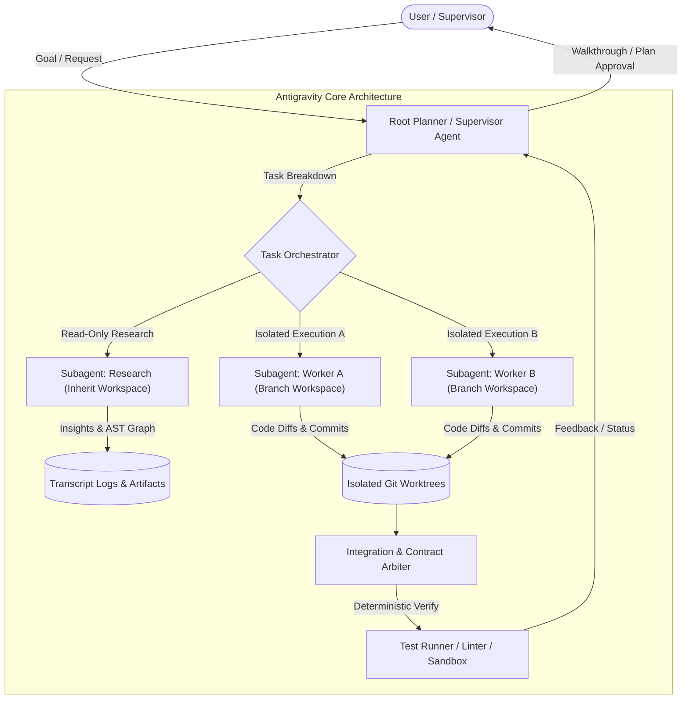
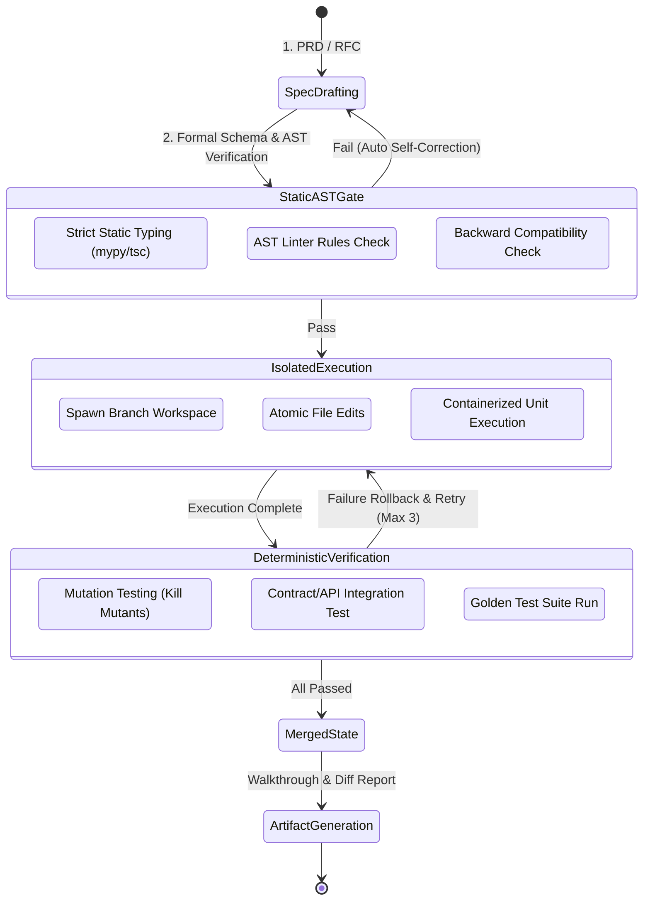

# [Gemini Persona] Antigravity 3대 킬러 유스케이스 및 엔지니어링 아키텍처 기획안

**Author:** Gemini (Multi-AI Collaboration Architecture Specialist)  
**Target:** Multi-AI Collaboration System / Supervisor (GPT)  
**Date:** 2026-08-28  
**Focus Areas:** 논리적 완결성(Logical Rigor), 시스템 구조화(Architecture), 장기 계획성(Long-term Planning), 결정론적 신뢰성(Determinism & Reliability)

---

## 1. Executive Summary & Gemini 관점의 접근법

Antigravity는 단순한 '코드 자동완성형 챗봇'이 아닌, **"장기 실행(Long-running), 계층형 오케스트레이션(Hierarchical Subagents), 작업 공간 격리(Workspace Isolation), 결정론적 검증(Deterministic Verification)"**을 내장한 차세대 에이전틱 소프트웨어 엔지니어링 플랫폼이다.

Gemini의 핵심 엔지니어링 철학에 입각하여, 본 기획서는 다음 3가지 원칙을 전제로 설계되었다:
1. **Context Entropy Control (컨텍스트 엔트로피 제어)**: LLM 컨텍스트 윈도우가 커질수록 발생하는 환각 및 주의력 분산(Attention Degradation) 문제를 서브에이전트 계층화와 격리된 워크스페이스(Branch/Share)로 완벽히 제어한다.
2. **Deterministic Feedback Loop (결정론적 피드백 루프)**: 모델의 생성 코드에 의존하지 않고, 정적 분석(AST/Linter) + 컴파일 + 런타임 테스트를 통한 폐루프(Closed-loop) 자가 교정 메커니즘을 구축한다.
3. **Spec-Driven Architecture (명세 주도 설계)**: 자연어 프롬프트의 모호성을 배제하고, Formal Schema(OpenAPI, AST Spec, DB Schema) 기반의 계약(Contract) 중심 협업 파이프라인을 확립한다.

---

## 2. 3대 킬러 유스케이스 정의 및 논리적 가치 제안 (Task A)

```mermaid
graph TD
    subgraph UC1["Use Case 1: Legacy Decoupling Engine"]
        A1[대규모 모놀리스 코드베이스] --> B1[AST 의존성 분석 & 경계 도출]
        B1 --> C1[격리 브랜치 병렬 리팩토링]
        C1 --> D1[무결점 모듈화 / MSA 마이그레이션]
    end

    subgraph UC2["Use Case 2: Autonomous RCA & Self-Healing"]
        A2[복합 결함/레이스 컨디션 발생] --> B2[재현 테스트 환경 격리 합성]
        B2 --> C2[Git Bisect & Taint Analysis]
        C2 --> D2[최소 변경 패치 & Fuzzing 검증]
    end

    subgraph UC3["Use Case 3: Spec-to-Production Pipeline"]
        A3[PRD / RFC 요구사항] --> B3[Formal Schema/Contract 생성]
        B3 --> C3[BE/FE 병렬 빌드 & Contract Test]
        C3 --> D3[E2E 검증 완료 프로덕션 코드]
    end
```

### [Use Case 1] 대규모 레거시 코드베이스 모듈화 및 점진적 마이그레이션 엔진 (Legacy Refactoring & Decoupling Engine)
* **목표 시장 및 타겟**: 5년 이상 누적된 엔터프라이즈 모놀리스(Java/Spring, C++, Go, Django 등) 시스템을 현대화하려는 엔지니어링 팀.
* **문제 상황**: 수십만 라인의 스파게티 코드, 순환 참조, 결합도로 인해 사람이 손대기 두려운 "기술 부채의 블랙홀".
* **Antigravity 차별점 및 가치 제안**:
  - 단일 LLM은 컨텍스트 용량 한계로 모놀리스 전체를 파악하지 못하지만, Antigravity는 **Read-only Graph Searcher 서브에이전트**로 전체 심볼 AST 의존성을 먼저 추출하여 추상화 모델(Graph DAG)을 빌드.
  - 모듈별로 `Workspace="branch"`를 분기하여 각 레이어(DTO, Service, Data Access)를 독립적으로 디커플링.
  - **ROI**: 엔지니어 수개월 분량의 마이그레이션 리스크를 며칠 단위로 단축, 회귀 결함 제로 달성.

### [Use Case 2] 무중단 장기 실행 결함 트리아지 및 회귀 제로 자가 치유 파이프라인 (Autonomous RCA & Self-Healing Pipeline)
* **목표 시장 및 타겟**: CI/CD 실패, 복잡한 비동기 동시성 이슈, 간헐적 테스트 실패(Flaky Test), 프로덕션 핫픽스 대응팀.
* **문제 상황**: 재현하기 어려운 비결정론적 레이스 컨디션 및 멀티 서비스 연동 버그 분석에 시니어 엔지니어의 리소스가 과도하게 소모됨.
* **Antigravity 차별점 및 가치 제안**:
  - `/goal` 커맨드 기반의 장기 자율 실행(Overnight RCA).
  - 서브에이전트 1: 격리 샌드박스에서 재현 스크립트 작성 및 Flaky 테스트 고정(Deterministic Reproducer).
  - 서브에이전트 2: Git Bisect + 실행 트레이스 분석을 통한 근본 원인(Root Cause) 특정.
  - 서브에이전트 3: 최소 침습(Least-Intrusive) 패치 생성 및 변이 테스트(Mutation Testing)로 사이드 이펙트 원천 차단.

### [Use Case 3] 스펙 기반 풀스택 동시 합성 및 계약 검증 파이프라인 (Spec-Driven Fullstack Compiler Pipeline)
* **목표 시장 및 타겟**: 신규 기능/서비스를 기획부터 프로덕션 배포까지 고속으로 딜리버리해야 하는 프로덕트 엔지니어링 팀.
* **문제 상황**: 프론트엔드와 백엔드 간의 API 명세 불일치, DB 스키마 마이그레이션 누락, 엣지 케이스 처리 미흡으로 인한 통합 테스트 병목.
* **Antigravity 차별점 및 가치 제안**:
  - PRD 문서를 입력받아 **Contract Authority Subagent**가 OpenAPI 3.1 / Protobuf / Zod 스키마 및 DB 마이그레이션 DDL을 단일 진실 공급원(Single Source of Truth)으로 확정.
  - 확정된 스키마를 기반으로 Backend Worker와 Frontend Worker가 독립 브랜치에서 병렬 구현.
  - Contract-testing 서브에이전트가 Mock Server와 실제 API 간 정합성을 자동 검증한 뒤 통합 브랜치로 병합.

---

## 3. Antigravity 아키텍처 메커니즘 설계 (Task B)

Antigravity의 내부 역학을 극대화하기 위한 오케스트레이션 아키텍처 및 데이터 흐름 설계는 다음과 같다.

### 3.1 계층형 멀티 에이전트 오케스트레이션 (Hierarchical Agent Topology)
1. **Supervisor / Root Agent**:
   - 상위 비즈니스 로직 분석, 전체 실행 DAG(Directed Acyclic Graph) 생성, 의사결정 승인 요청.
   - 직접적인 대량 코드 수정을 지양하고, 하위 서브에이전트에게 멱등성(Idempotency)을 가진 단위 태스크 할당.
2. **Specialized Subagent Nodes**:
   - `AST & Dependency Analyst` (Role: Codebase Architecture Research, Model: `flash` or `inherit`, Read-only tools).
   - `Schema & Contract Enforcer` (Role: Strict Type Definition & Test Scaffolding, Model: `pro`).
   - `Domain Feature Implementer` (Role: Isolated Logic Writer, Model: `pro`, Write-tools enabled).
   - `Adversarial Verifier & QA` (Role: Edge-case Injection & Mutation Tester, Model: `flash`).

### 3.2 컨텍스트 격리 및 메모리 엔트로피 방어 전략
* **Workspace Branching (`branch` vs `share`)**:
  - `branch`: 완전히 독립된 복제 작업 공간에서 코드를 작성하여 파일 충돌 및 중간 빌드 실패가 메인 워크스페이스에 전파되지 않도록 차단.
  - `share`: 읽기 중심 태스크나 대용량 바이너리 저장소에서 스토리지 낭비 없이 브랜치만 격리하여 분석 속도 극대화.
* **Non-Leaking Context Protocol**:
  - 서브에이전트의 긴 탐색 트랜스크립트는 메인 에이전트의 컨텍스트에 직접 주입되지 않음.
  - `send_message`를 통한 정형화된 JSON/요약 리포트와 Artifacts(`implementation_plan.md`, `walkthrough.md`) 파일 경로만을 전달하여 Root의 컨텍스트를 항상 30% 미만으로 청정하게 유지.

### 3.3 정밀 파일 시스템 및 툴 제어 메커니즘
* **Targeted Slice Editing (`replace_file_content`)**:
  - 전체 파일 덮어쓰기를 방지하고, 정확한 Line Range와 Target/Replacement Chunk를 기반으로 AST 파싱 오류를 최소화.
* **Reactive Wakeup & Non-Polling Asynchrony**:
  - 백그라운드 태스크 및 서브에이전트 실행 시 능동 폴링(Busy-looping)을 금지하고, 시스템 레벨 이벤트 기반의 `Reactive Wakeup`으로 API 레이트 리밋 및 컴퓨팅 리소스 보호.

---

## 4. 시스템 안정성 및 결정론적 검증 파이프라인 (Task C)

LLM의 확률론적(Probabilistic) 불확실성을 상쇄하고, 산업 표준의 엔지니어링 신뢰성을 확보하기 위한 **"3단계 결정론적 게이트(Deterministic Quality Gate)"**를 구축한다.

### 4.1 상태 일관성 보장 매트릭스 (State Consistency Matrix)

| 계층 (Layer) | 검증 대상 (Target) | 검증 도구 및 방식 | 실패 시 롤백/복구 전략 (Self-Healing) |
| :--- | :--- | :--- | :--- |
| **L1. 문법 및 타입 (Syntax & Type)** | AST 무결성, 타입 계약 | TypeScript `tsc --noEmit`, Python `mypy --strict`, Rust `cargo check` | 오류 라인 번호 기반 즉각적인 `replace_file_content` 패치 적용 |
| **L2. 계약 및 스키마 (API Contract)** | OpenAPI, GraphQL, DB DDL | Prism Mock Server, Schemathesis, DBMate Dry-run | 스키마 브레이킹 체인지 감지 시 하위 호환성 레이어(Adapter) 강제 합성 |
| **L3. 기능 무결성 (Functional QA)** | 유닛/통합/회귀 테스트 | Pytest, Vitest, Jest with Coverage Threshold (>90%) | 브랜치 워크스페이스 폐기 후 이전 안정 스냅샷으로 `git reset --hard` |
| **L4. 회귀 및 엣지 (Mutation/Edge)** | 비정상 입력 및 경계값 결함 | Stryker / Mutmut (변이 테스트), Hyperschema Fuzzing | 서브에이전트 간 Adversarial Review 단계에서 반려 및 재계획 |

### 4.2 자가 교정 및 무한 루프 방지 알고리즘
1. **Error Fingerprint Tracking**: 동일한 컴파일/런타임 에러 시그니처가 2회 연속 발생할 경우, 단순 코드 재작성이 아닌 "설계 가설 기각(Hypothesis Invalidation)" 루틴으로 승격.
2. **Finite State Retry Budget**: 태스크당 최대 교정 시도 횟수를 3회로 제한(Budget=3). 초과 시 Root Agent에 인터럽트 신호를 보내 사용자 피드백 요청(`AskQuestion` 또는 Planning Mode 재진입).
3. **Artifact-Driven Auditability**: 모든 의사결정과 diff는 `implementation_plan.md`와 `walkthrough.md`에 추적 가능하도록 실시간 마크다운 동기화.

---

## 5. 결론 및 종합 평가 (Gemini's Synthesis)

Antigravity는 단순한 AI 어시스턴트를 넘어, **"엔지니어링 복잡도(Engineering Complexity)를 결정론적으로 제어하는 멀티 에이전트 운영체제"**로 포지셔닝될 때 가장 강력한 파괴력을 발휘한다.

1. **Task A (가치 제안)**: 대규모 레거시 마이그레이션, 심층 결함 RCA, 스펙 주도 풀스택 완성을 통해 엔지니어링 리드 타임을 극적으로 단축.
2. **Task B (아키텍처)**: 계층적 서브에이전트 토폴로지와 브랜치형 워크스페이스 격리를 통한 컨텍스트 오염 방지.
3. **Task C (신뢰성)**: 4단계 결정론적 품질 게이트와 변이 테스트 기반 자가 치유 피드백 루프를 통해 환각 없는 프로덕션 품질 코드 보장.

이상의 아키텍처적 접근은 GPT의 기획력 및 타 AI 모델의 장점과 유기적으로 결합하여 최고 수준의 Multi-AI Collaboration 시너지를 창출할 것이다.
