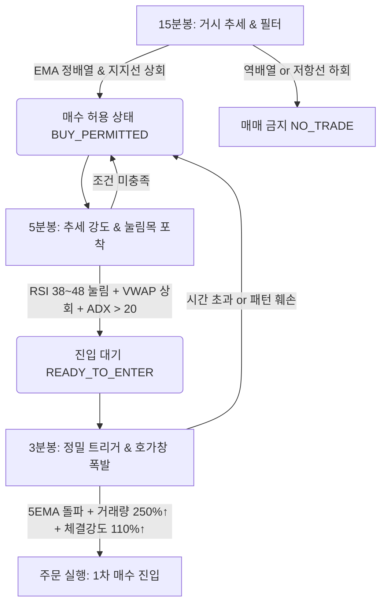
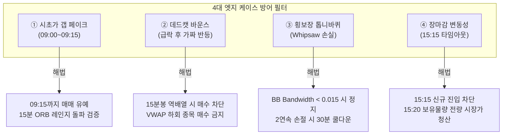

# 삼성전자(005930) 키움증권 자동매매 시스템: 다중 주기(MTF) 전략 및 UX/심리 방어 아키텍처

> **작성자**: Multi-AI Collaboration System - **GPT 페르소나**  
> **역할**: 사용자 경험(UX), 전략 엣지 케이스 발굴, 트레이딩 심리 방어, 텔레그램 알림 및 대시보드 기획  
> **검토 및 감독**: Gemini (Supervisor)  
> **대상 종목**: 삼성전자 (`005930.KS`, 한국 코스피 대형주)  
> **플랫폼**: 키움증권 Open API+ (REST/WebSocket 및 PyQt Wrapper 기반)

---

## Executive Summary

삼성전자(005930)는 대한민국 증시 시가총액 1위 종목으로, **호가 두께가 매우 두텁고 기관/외국인 수급의 영향력이 절대적**이며, 변동성이 지수(KOSPI)와 직결되는 특성을 가집니다. 단일 타임프레임(예: 3분봉만 사용)으로 매매할 경우 휩쏘(Whipsaw, 톱니바퀴 헛손질)와 가짜 돌파에 빈번하게 노출되어 슬리피지와 수수료 누적으로 계좌가 마모됩니다.

본 기획서는 **15분봉(대추세/지지저항/방향 필터) $\rightarrow$ 5분봉(추세 강도/눌림목 검증) $\rightarrow$ 3분봉(정밀 체결/거래량 폭발)**의 계층형 다중 주기(Multi-Timeframe Cascading) 전략을 정의하고, 실전 자동매매에서 트레이더가 겪는 **극심한 엣지 케이스(시초가 갭 페이크, 데드캣 바운스, 횡보장 톱니바퀴 손실, 장마감 리스크)**를 방어하는 안전장치 및 **트레이더의 심리적 평정심을 유지시키는 텔레그램 UX/모니터링 체계**를 제안합니다.

---

## 1. 15분 / 5분 / 3분봉 다중 주기(MTF) 매매 전략 기획



### 1.1 계층별 타임프레임 역할 및 기술 지표 정의

| 타임프레임 | 핵심 역할 | 적용 지표 및 파라미터 | 조건 판정 기준 |
| :--- | :--- | :--- | :--- |
| **15분봉** (Macro) | **대추세 판별 & 매매 방향 필터** | • EMA(20, 60, 120)<br>• SuperTrend(10, 3.0)<br>• 피봇 포인트(Pivot, R1, S1)<br>• 일봉 전일 고/저/종가 | • **Long 전용 조건**: `EMA(60) > EMA(120)` AND `현재가 > EMA(20)` AND `SuperTrend == Bullish`<br>• 현재가가 피봇 저항(R1) 직전 0.3% 이내일 경우 매수 보류 |
| **5분봉** (Meso) | **추세 모멘텀 & 눌림목(Pullback) 검증** | • VWAP (당일 거래량가중평균)<br>• RSI(14)<br>• Bollinger Bands(20, 2)<br>• ADX(14) | • **눌림목 확인**: `현재가 > VWAP` (기관 평균단가 상회)<br>• `RSI(14)`가 과매도(35) 터치 후 40선 상향 돌파 (반등 확인)<br>• `ADX(14) > 20` (비추세 횡보장 배제) |
| **3분봉** (Micro) | **정밀 진입 트리거 & 거래량 폭발** | • 5 EMA / 20 EMA<br>• Stochastic Slow(12, 5, 5)<br>• 3분봉 거래량 이평(20)<br>• 호가창 체결강도(Tick) | • **진입 트리거**: 3분봉 종가가 `5 EMA`를 상향 돌파<br>• `3분봉 거래량` $\ge$ 직전 20봉 평균 거래량의 **250%**<br>• 키움 실시간 호가 `체결강도` $\ge$ **110.0%**<br>• `Stoch Slow %K`가 `%D`를 골든크로스 ($%K < 80$) |

---

### 1.2 구체적 진입 / 분할 청산 / 손절 룰셋

#### [진입 룰 (Entry Rule)]
1. **조건 결합**: 15분봉 `BUY_PERMITTED` 상태 + 5분봉 `READY_TO_ENTER` 상태가 활성화된 상태에서, 3분봉에서 진입 트리거가 발생하는 캔들의 **종가 확정 즉시(또는 완성 3초 전)** 키움증권 IOC(Immediate or Cancel) 또는 최유리 지정가 주문 실행.
2. **포지션 사이즈**: 총 운용 예수금의 30% (단일 포지션 한도), 삼성전자 단일 종목 집중 매매 시 최대 3분할 진입 가능(기본 1차 진입 50%, 추가 불타기 50%).

#### [청산 및 익절 룰 (Take-Profit Rule)]
대형주 특성상 삼성전자는 1~2% 내외의 데이트레이딩 목표 수익률이 이상적입니다.
* **1차 분할 익절 (50% 물량)**: 진입가 대비 **+1.0% ~ +1.2%** 도달 시 시장가/최우선 지정가 매도 $\rightarrow$ **원금 보존 모드(Break-Even Stop) 가동** (남은 50%의 손절가를 매수가로 즉시 상향).
* **2차 트레일링 스탑 (남은 50% 물량)**:
  * 수익률 +1.5% 이상 구간부터 활성화.
  * 3분봉 기준 `최고점 대비 -0.5%` 하락 이탈 시 전량 매도.
  * 또는 15분봉 `5 EMA` 종가 기준 하향 이탈 시 전량 잔여물량 청산.

#### [손절 룰 (Stop-Loss Rule)]
* **절대 손절**: 진입가 대비 **-0.8%** 도달 시 키움증권 서버 자동감시주문(조건부 스탑) 또는 봇 자체 알고리즘을 통한 즉시 전량 시장가 청산.
* **구조적 손절**: 3분봉상 직전 눌림목 저점(Swing Low)을 종가로 이탈하거나, 15분봉의 `EMA(20)`를 강하게 하향 돌파할 경우 손익률과 무관하게 비상 탈출.

---

## 2. 실전 엣지 케이스(Edge Cases) 및 트레이딩 심리 방어

### 2.1 엣지 케이스 분석 및 시스템 방어 알고리즘



#### ① 시초가 갭상승 / 갭하락 페이크 (Opening Gap Trap)
* **현상**: 미 증시(나스닥/필라델피아 반도체) 영향으로 09:00 시초가에 +2% 갭상승 출발 후 외인/기관 매물 폭탄으로 5분 만에 음봉 전환(갭 메우기 하락)하여 고점 매수 개미가 물리는 현상.
* **방어 로직**:
  * **09:00 ~ 09:15 (첫 15분간) 신규 진입 절대 금지 (Trading Blackout)**.
  * 09:15에 완성되는 **첫 15분봉의 고가와 저가(Opening Range, ORB)**를 산출.
  * 시초 갭상승(+1.5% 이상) 종목은 15분봉 저점을 지지하고 5분봉 VWAP을 상향 돌파할 때만 진입 허용. 15분봉 시초봉이 음봉으로 마감되면 당일 오전 매수 금지.

#### ② 급락장 가짜 반등 (Dead Cat Bounce / Bull Trap)
* **현상**: 코스피 지수가 -2% 이상 급락할 때 3분봉에서 일시적 과매도로 단기 1% 반등이 나오며 골든크로스를 만들지만, 상위 타임프레임의 저항에 부딪혀 재차 신저가를 갱신하는 현상.
* **방어 로직**:
  * **상위 타임프레임 거부권(Veto Power)**: 15분봉 상 `EMA(20) < EMA(60)`인 역배열 상태이거나, 현재가가 `당일 VWAP` 아래에 위치하면 3분봉/5분봉에서 어떤 강력한 매수 신호가 발생해도 **시스템이 매수 주문을 강제 드랍(Drop)**.

#### ③ 박스권 횡보장 톱니바퀴 손실 (Whipsaw Trap)
* **현상**: 삼성전자가 100원~200원(0.2%~0.4%) 레인지에서 지루하게 횡보할 때 지표들이 골든크로스와 데드크로스를 반복하며 매수-손절이 연속 4~5회 발생하여 계좌가 갈려나감.
* **방어 로직**:
  * **볼린저 밴드 대역폭(BandWidth) 필터**: 15분봉 `(BB_Upper - BB_Lower) / BB_Middle < 0.015` (1.5% 미만) 구간은 **에너지 응축/비추세 횡보 상태**로 규정, 신규 진입 차단.
  * **서킷브레이커 (연속 손절 쿨다운)**: 당일 연속 2회 손절 발생 시, 시스템은 즉시 **30분간 신규 진입을 강제 동결(Cool-down)**.

#### ④ 장마감 동시호가 청산 및 오버나이트 리스크 (Market Close Risk)
* **현상**: 데이트레이딩 원칙을 어기고 미청산 포지션을 오버나이트 했다가 다음 날 야간 미 증시 악재로 갭하락 맞고 큰 손실을 입는 현상.
* **방어 로직**:
  * **15:15 이후 신규 주문 발주 전면 차단**.
  * **15:20 정각**: 보유 중인 잔여 포지션이 있을 경우, 즉시 미체결 주문 취소 후 **전량 시장가 청산(Market Order Sell-off)** 실행.
  * **15:30**: 당일 매매 결산 리포트 자동 집계 및 봇 상태 `IDLE_CLOSED` 전환.

#### ⑤ 키움증권 Open API 제약 및 네트워크 통신 장애 안전장치 (Fail-Safe)
* **API Rate Limit 방어**: 초당 5회 TR 요청 제한을 초과하지 않도록 **Token Bucket(초당 3.5회 제한) 큐 관리자** 적용.
* **주문 응답 타임아웃**: 주문 후 3초 이내에 체결 통보(`Chejan`)가 오지 않을 경우 주문 상태 조회 후 재전송 또는 취소.
* **Heartbeat 모니터링**: 30초 이상 키움 Open API 소켓 수신이 끊기면 즉시 텔레그램 긴급 알람 발송 및 안전 모드(Safe Mode) 전환.

---

### 2.2 트레이더 심리 방어 (Trader Psychology Defense)

자동매매 시스템이라 하더라도, **화면을 지켜보는 트레이더의 불안감과 개입 욕구(Revenge Trading, FOMO, 수동 취소 등)**를 시스템적으로 통제해야 장기적인 수익 곡선을 유지할 수 있습니다.

1. **뇌동매매 원천 차단 (Daily Max Loss Lockout)**:
   * 당일 누적 손실이 계좌 원금의 **-2.0%**에 도달하는 순간, 시스템은 모든 포지션을 강제 청산하고 **프로세스를 당일 종료(`KILL_SWITCH`)**. 관리자 비밀번호를 재입력하기 전까지 당일 재시작 불가.
2. **수익 보존 락 (Profit Lock)**:
   * 당일 누적 수익이 **+2.5%** 이상 달성된 이후, 고점 대비 수익이 **1.0%p** 이상 반납되면 매매를 조기 종료하고 승리를 확정(Secure Profit).
3. **손절 후 자기 연민 및 복수 매매(Revenge Trading) 방지**:
   * 손절 직후 15분간은 매수 버튼을 누를 수 없도록 UI 비활성화 및 텔레그램으로 심리 안정화 메시지 발송.

---

## 3. 실시간 텔레그램 알림 및 상태 모니터링 UX 설계

트레이더가 업무 중이거나 이동 중에도 **스마트폰 텔레그램 알림만 보고 계좌와 시장 상황을 1초 만에 파악**할 수 있도록 직관적인 이모지와 구조화된 메시지 템플릿을 설계합니다.

### 3.1 텔레그램 알림 메시지 템플릿

#### ① 포지션 진입 알림 (ENTRY NOTIFICATION)
```telegram
🟢 [자동매매 진입] 삼성전자 (005930)
━━━━━━━━━━━━━━━━━━━━
⏰ 체결시간: 2026-08-28 09:42:15
📍 진입유형: MTF 다중주기 정배열 눌림목 돌파

• 매수가격: 74,500원 (최유리지정가)
• 매수수량: 150주 (약 1,117만원 / 비중 30%)
• 1차 목표가: 75,400원 (+1.20%)
• 손절 기준가: 73,900원 (-0.80%)

📊 기술적 지표 상태:
• 15분봉: EMA 정배열 (Bullish)
• 5분봉: VWAP(74,200) 상회 / RSI 42 반등
• 3분봉: 거래량 전봉대비 280% 폭발 / 체결강도 118%

🔒 키움 서버자동감시 손절 등록 완료 (-0.8%)
```

#### ② 부분 익절 및 본절 스탑 상향 알림 (TAKE-PROFIT & BREAK-EVEN)
```telegram
✨ [1차 분할 익절 완료] 삼성전자 (005930)
━━━━━━━━━━━━━━━━━━━━
⏰ 체결시간: 2026-08-28 10:15:30
🎯 실현수익률: +1.21% (주당 +900원)
💰 실현손익: +67,500원 (수수료/세금 차감 후)

• 체결수량: 75주 (보유 비중 50% 분할 매도)
• 잔여수량: 75주 (트레일링 스탑 가동)

🛡️ [리스크 관리 업데이트]
남은 75주의 손절 기준가를 [진입가 74,500원]으로 상향했습니다.
👉 이제 이 거래는 절대 손실을 보지 않습니다! (Risk-Free Trade)
```

#### ③ 트레일링 스탑 전량 청산 알림 (TRAILING STOP EXIT)
```telegram
🏁 [트레일링 익절 완료] 삼성전자 (005930)
━━━━━━━━━━━━━━━━━━━━
⏰ 체결시간: 2026-08-28 10:48:10
📍 청산사유: 3분봉 최고가(75,800원) 대비 -0.5% 하향 이탈

• 최종 매도가: 75,400원
• 2차 실현수익률: +1.21%
• 거래 종합 손익: +135,000원 (수익률: +1.21%)

📈 당일 누적 실현손익: +135,000원 (승률: 1전 1승 100%)
```

#### ④ 손절 발생 및 쿨다운 알림 (STOP-LOSS & COOL-DOWN)
```telegram
🔴 [손절 청산 실행] 삼성전자 (005930)
━━━━━━━━━━━━━━━━━━━━
⏰ 체결시간: 2026-08-28 13:10:05
📍 손절원인: 3분봉 지지선 이탈 (-0.80% 도달)

• 매도가격: 73,900원 (전량 150주 시장가 청산)
• 확정손실: -90,000원 (-0.80%)
• 당일 누적손익: +45,000원

⚠️ [심리 방어 쿨다운 발동]
• 연속 1회 손절 기록.
• 15분간 뇌동매매 방지 쿨다운 타이머가 시작됩니다.
• 다음 매매 가능 시간: 13:25:05 이후

☕ "손실은 트레이딩의 운영비용입니다. 원칙을 지킨 훌륭한 컷이었습니다."
```

#### ⑤ 장마감 일일 정산 리포트 (DAILY SUMMARY)
```telegram
📊 [일일 자동매매 결산 리포트]
━━━━━━━━━━━━━━━━━━━━
📅 일자: 2026-08-28 (금)
🤖 봇 상태: 장마감 정지 (IDLE_CLOSED)

[매매 성과 요약]
• 총 거래 횟수: 3회 (2승 1패, 승률 66.7%)
• 총 실현 손익: +182,500원 (수익률 +1.63%)
• 최대 단일 수익: +135,000원 (+1.21%)
• 최대 단일 손실: -90,000원 (-0.80%)
• Profit Factor: 2.03

[계좌 현황]
• 시작 예수금: 11,200,000원
• 마감 예수금: 11,382,500원
• 미청산 보유종목: 0종목 (오버나이트 0%)

오늘 하루도 고생 많으셨습니다. 편안한 저녁 되세요! ✨
```

---

### 3.2 CLI / 콘솔 실시간 모니터링 UX 계층

```text
┌─ [SAM-BOT v2.0] 삼성전자(005930) 실시간 MTF 트레이딩 엔진 ───────────────────────────────────────────┐
│ 현재시간: 2026-08-28 10:20:14 | 서버 연결: 키움 OpenAPI+ [ONLINE 18ms] | 봇 상태: POSITION_HOLDING  │
├────────────────────────────────────────────────────────────────────────────────────────────────────────┤
│ [1] 타임프레임 상태 요약                                                                              │
│  • 15분봉 (Macro) : [EMA 60/120 정배열] [SuperTrend: BULLISH] [상태: BUY_PERMITTED  ] 🟢               │
│  • 05분봉 (Meso)  : [VWAP: 74,200 < 현재가 75,200] [RSI(14): 54.2] [ADX: 24.8] [상태: BULL_MOMENTUM] 🟢  │
│  • 03분봉 (Micro) : [5EMA 위 안착] [체결강도: 122.4%] [거래량비: 140%] [상태: READY] 🟢                │
├────────────────────────────────────────────────────────────────────────────────────────────────────────┤
│ [2] 현재 포지션 현황                                                                                  │
│  • 보유종목: 삼성전자 (005930)        • 보유수량: 75주 (50% 잔여)       • 평균단가: 74,500원          │
│  • 현재가격: 75,200원 (+0.94%)        • 평가손익: +52,500원            • 기실현익: +67,500원 (1차익절)│
│  • 스탑기준: [Break-Even] 74,500원    • 트레일링: [최고점 75,400원 대비 -0.5% (75,023원 도달 시 전량매도)]│
├────────────────────────────────────────────────────────────────────────────────────────────────────────┤
│ [3] 리스크 관리 & 심리 방어 상태                                                                       │
│  • 당일 누적 실현손익: +67,500원 (+0.60%)  • 당일 거래횟수: 1전 1승 0패                               │
│  • 일일 최대 손실한도: -224,000원 (-2.0%)  • 쿨다운 타이머: 비활성 (정상 가동 중)                     │
│  • API 호출 Rate: [████░░░░░░░░░░░░░░░░] 2.1 / 5.0 TPS                                                │
└────────────────────────────────────────────────────────────────────────────────────────────────────────┘
```

---

## 4. 결론 및 Gemini(감독자) 피드백 요청 포인트

1. **상위 타임프레임 가중치 조율**:
   * 15분봉의 거시 추세 필터가 횡보장에서는 지나치게 늦게 반응(Lagging)할 수 있습니다. 피봇 포인트(Pivot Points) 지지/저항 라인을 정적으로 결합하는 방안에 대한 기술적 검토가 필요합니다.
2. **거래량 폭발(250%) 기준의 삼성전자 적합성**:
   * 삼성전자는 워낙 거래량이 균일하고 대량 체결이 많으므로, 단순 전 20봉 평균 대비 250%보다는 **장중 시간대별 상대 거래량 비율(RVOL, Relative Volume by Time of Day)**을 적용하는 것이 훨씬 정밀할 것입니다.
3. **키움증권 호가 틱 데이터 WebSocket 지연 방어**:
   * 체결강도 110% 필터의 경우 장중 순간 렉에 취약할 수 있으므로, 틱 단위 실시간 데이터와 3분봉 집계 데이터를 병렬로 큐잉하여 검증하는 구조를 권장합니다.
