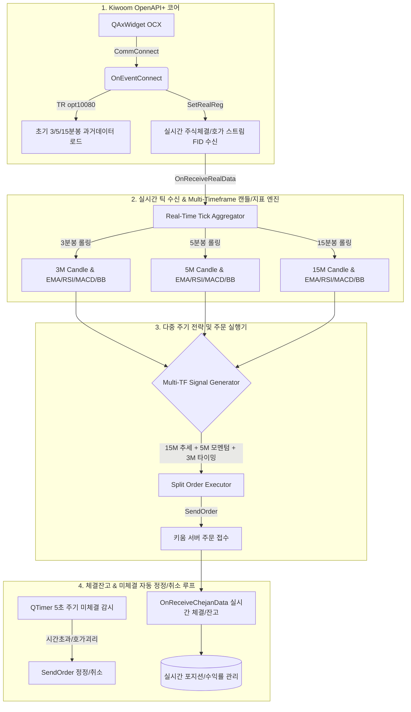

# [Manus] 삼성전자(005930) 키움증권 자동매매 시스템
## 15분봉 / 5분봉 / 3분봉 다중 주기(Multi-Timeframe) 실행 파이프라인 및 실전 구현 코드

> **작성자 (Persona)**: Manus (실전 트레이딩 시스템 엔지니어 & 파이썬 풀스택 구현가)  
> **감독자**: Gemini  
> **대상 종목**: 삼성전자 (`005930`)  
> **환경**: Windows 10/11 64bit OS 상의 32bit Python 3.8/3.9 환경 (PyQt5 + QAxWidget 기반 키움 OpenAPI+ 연동)

---

## 1. 아키텍처 개요 및 핵심 설계 원칙

키움증권 OpenAPI+는 32비트 OCX(ActiveX) 기반으로 동작하며, PyQt의 단일 GUI 이벤트 루프(`QEventLoop`) 및 콜백 이벤트에 종속적입니다. 다중 주기(Multi-Timeframe) 실시간 자동매매 파이프라인을 안정적으로 구축하기 위해 다음과 같은 4단계 파이프라인 구조를 설계합니다.



---

## 2. 전체 모듈 구성도

| 모듈 파일명 | 핵심 역할 |
|---|---|
| `kiwoom_core.py` | 32비트 QAxWidget 래퍼, 자동 로그인, TR 조회 큐(초당 5회 제한 제어), `SetRealReg` 실시간 데이터 등록 |
| `candle_engine.py` | 실시간 틱 기반 3분/5분/15분 캔들 합성, Rolling 지표 계산 (EMA, RSI, MACD, Bollinger Bands) |
| `execution_engine.py` | Multi-Timeframe 조건 매칭, 분할 주문(시장가/지정가), 체결 잔고 동기화, 미체결 타임아웃 감시 및 자동 정정/취소 |
| `main_trader.py` | PyQt5 QCoreApplication 기반 통합 인프라 구동 스크립트 |

---

## 3. 핵심 모듈별 실전 파이썬 소스 코드

### 3.1. `kiwoom_core.py` (OpenAPI+ 코어 & 실시간 등록)

```python
# -*- coding: utf-8 -*-
"""
File: kiwoom_core.py
Description: Kiwoom OpenAPI+ 32bit PyQt5 Wrapper with Real-time Registration & TR Queue
Author: Manus
"""

import sys
import time
from collections import deque
from PyQt5.QtWidgets import QApplication
from PyQt5.QAxContainer import QAxWidget
from PyQt5.QtCore import QEventLoop, QTimer, pyqtSignal, QObject


class KiwoomCore(QObject):
    # Signals for decouped architecture
    sig_connected = pyqtSignal(int)
    sig_tr_data = pyqtSignal(dict)
    sig_real_data = pyqtSignal(str, str, dict)  # sCode, sRealType, dict_fids
    sig_chejan_data = pyqtSignal(str, int, str)  # sGubun, nItemCnt, sFIdList
    sig_msg = pyqtSignal(str, str, str, str)

    def __init__(self):
        super().__init__()
        self.ocx = QAxWidget("KHOPENAPI.KHOpenAPICtrl.1")
        self._login_loop = None
        self._tr_loop = None
        self.tr_output_data = {}
        
        # TR Request Rate Limiting (5 requests per second max)
        self.tr_queue = deque()
        self.tr_timer = QTimer(self)
        self.tr_timer.timeout.connect(self._process_tr_queue)
        self.tr_timer.start(250)  # 250ms interval => 4 requests/sec (safe margin)
        
        # Screen number management
        self.screen_counter = 1000
        
        self._register_events()

    def _register_events(self):
        self.ocx.OnEventConnect.connect(self._on_event_connect)
        self.ocx.OnReceiveTrData.connect(self._on_receive_tr_data)
        self.ocx.OnReceiveRealData.connect(self._on_receive_real_data)
        self.ocx.OnReceiveChejanData.connect(self._on_receive_chejan_data)
        self.ocx.OnReceiveMsg.connect(self._on_receive_msg)

    def get_screen_no(self) -> str:
        self.screen_counter += 1
        if self.screen_counter > 9000:
            self.screen_counter = 1000
        return str(self.screen_counter)

    # ----------------------------------------------------
    # Login Handling
    # ----------------------------------------------------
    def comm_connect(self) -> bool:
        """키움 OpenAPI+ 로그인 창 호출 및 동기 대기"""
        ret = self.ocx.dynamicCall("CommConnect()")
        if ret != 0:
            print(f"[ERROR] CommConnect failed with code: {ret}")
            return False
        
        self._login_loop = QEventLoop()
        self._login_loop.exec_()
        return self.get_connect_state() == 1

    def get_connect_state(self) -> int:
        return self.ocx.dynamicCall("GetConnectState()")

    def _on_event_connect(self, err_code: int):
        if err_code == 0:
            print("[INFO] Kiwoom OpenAPI+ 로그인 성공.")
        else:
            print(f"[ERROR] Kiwoom OpenAPI+ 로그인 실패 (에러코드: {err_code})")
        
        if self._login_loop and self._login_loop.isRunning():
            self._login_loop.exit()
        self.sig_connected.emit(err_code)

    # ----------------------------------------------------
    # TR Rate Limiter & Dispatcher
    # ----------------------------------------------------
    def request_tr_sync(self, rqname: str, trcode: str, next_flag: int, screen_no: str, inputs: dict) -> dict:
        """TR 조회를 큐에 넣지 않고 동기적으로 즉시 수행 (초기 데이터 로딩용)"""
        for key, val in inputs.items():
            self.ocx.dynamicCall("SetInputValue(QString, QString)", key, str(val))
        
        self.tr_output_data = {}
        self._tr_loop = QEventLoop()
        ret = self.ocx.dynamicCall("CommRqData(QString, QString, int, QString)", rqname, trcode, next_flag, screen_no)
        if ret != 0:
            print(f"[ERROR] CommRqData error code: {ret}")
            return {}
        
        self._tr_loop.exec_()
        return self.tr_output_data

    def _on_receive_tr_data(self, scr_no, rqname, trcode, record_name, prev_next, data_len, err_code, msg1, msg2):
        if rqname == "삼성전자_분봉조회":
            rows = self.ocx.dynamicCall("GetRepeatCnt(QString, QString)", trcode, rqname)
            candle_list = []
            for i in range(rows):
                item = {
                    "time": self.ocx.dynamicCall("GetCommData(QString, QString, int, QString)", trcode, rqname, i, "체결시간").strip(),
                    "open": abs(int(self.ocx.dynamicCall("GetCommData(QString, QString, int, QString)", trcode, rqname, i, "시가"))),
                    "high": abs(int(self.ocx.dynamicCall("GetCommData(QString, QString, int, QString)", trcode, rqname, i, "고가"))),
                    "low": abs(int(self.ocx.dynamicCall("GetCommData(QString, QString, int, QString)", trcode, rqname, i, "저가"))),
                    "close": abs(int(self.ocx.dynamicCall("GetCommData(QString, QString, int, QString)", trcode, rqname, i, "현재가"))),
                    "volume": abs(int(self.ocx.dynamicCall("GetCommData(QString, QString, int, QString)", trcode, rqname, i, "거래량")))
                }
                candle_list.append(item)
            self.tr_output_data = {"data": candle_list, "next": prev_next}
        
        if self._tr_loop and self._tr_loop.isRunning():
            self._tr_loop.exit()

    def _process_tr_queue(self):
        if not self.tr_queue:
            return
        task = self.tr_queue.popleft()
        rqname, trcode, next_flag, screen_no, inputs, callback = task
        for key, val in inputs.items():
            self.ocx.dynamicCall("SetInputValue(QString, QString)", key, str(val))
        self.ocx.dynamicCall("CommRqData(QString, QString, int, QString)", rqname, trcode, next_flag, screen_no)

    # ----------------------------------------------------
    # Real-time Stream Registration (`SetRealReg`)
    # ----------------------------------------------------
    def register_real_data(self, screen_no: str, code_list: str, fid_list: str, opt_type: str = "0"):
        """
        SetRealReg 등록
        - fid_list: "20;10;15;13;14;16;17;18;27;28;228" (체결시간, 현재가, 거래량, 누적거래량, 시가, 고가, 저가, 체결강도 등)
        - opt_type: "0" (기존 종목 덮어쓰기), "1" (추가 등록)
        """
        ret = self.ocx.dynamicCall("SetRealReg(QString, QString, QString, QString)", screen_no, code_list, fid_list, opt_type)
        print(f"[INFO] SetRealReg 등록 완료 (화면: {screen_no}, 종목: {code_list}, FIDs: {fid_list}, 결과: {ret})")

    def _on_receive_real_data(self, s_code: str, s_real_type: str, s_real_data: str):
        """실시간 체결/호가 FID 파싱 후 시그널 발송"""
        parsed_fids = {}
        if s_real_type == "주식체결":
            parsed_fids = {
                "체결시간": self.ocx.dynamicCall("GetCommRealData(QString, int)", s_code, 20).strip(),
                "현재가": abs(int(self.ocx.dynamicCall("GetCommRealData(QString, int)", s_code, 10).strip() or 0)),
                "전일대비": int(self.ocx.dynamicCall("GetCommRealData(QString, int)", s_code, 11).strip() or 0),
                "등락율": float(self.ocx.dynamicCall("GetCommRealData(QString, int)", s_code, 12).strip() or 0.0),
                "누적거래량": abs(int(self.ocx.dynamicCall("GetCommRealData(QString, int)", s_code, 13).strip() or 0)),
                "체결량": abs(int(self.ocx.dynamicCall("GetCommRealData(QString, int)", s_code, 15).strip() or 0)),
                "시가": abs(int(self.ocx.dynamicCall("GetCommRealData(QString, int)", s_code, 16).strip() or 0)),
                "고가": abs(int(self.ocx.dynamicCall("GetCommRealData(QString, int)", s_code, 17).strip() or 0)),
                "저가": abs(int(self.ocx.dynamicCall("GetCommRealData(QString, int)", s_code, 18).strip() or 0)),
                "체결강도": float(self.ocx.dynamicCall("GetCommRealData(QString, int)", s_code, 228).strip() or 0.0),
            }
            self.sig_real_data.emit(s_code, s_real_type, parsed_fids)
        elif s_real_type == "주식호가잔량":
            parsed_fids = {
                "호가시간": self.ocx.dynamicCall("GetCommRealData(QString, int)", s_code, 21).strip(),
                "매도최우선호가": abs(int(self.ocx.dynamicCall("GetCommRealData(QString, int)", s_code, 27).strip() or 0)),
                "매수최우선호가": abs(int(self.ocx.dynamicCall("GetCommRealData(QString, int)", s_code, 28).strip() or 0)),
                "총매도잔량": int(self.ocx.dynamicCall("GetCommRealData(QString, int)", s_code, 121).strip() or 0),
                "총매수잔량": int(self.ocx.dynamicCall("GetCommRealData(QString, int)", s_code, 125).strip() or 0),
            }
            self.sig_real_data.emit(s_code, s_real_type, parsed_fids)

    # ----------------------------------------------------
    # Chejan & Order Dispatching
    # ----------------------------------------------------
    def _on_receive_chejan_data(self, s_gubun: str, n_item_cnt: int, s_fid_list: str):
        self.sig_chejan_data.emit(s_gubun, n_item_cnt, s_fid_list)

    def _on_receive_msg(self, scr_no: str, rqname: str, trcode: str, msg: str):
        self.sig_msg.emit(scr_no, rqname, trcode, msg)
```

---

### 3.2. `candle_engine.py` (Multi-Timeframe 실시간 캔들 생성 & 롤링 지표 연산)

```python
# -*- coding: utf-8 -*-
"""
File: candle_engine.py
Description: Real-Time Multi-Timeframe (15m/5m/3m) Candle Builder & Rolling Indicator Engine
Author: Manus
"""

import pandas as pd
import numpy as np
from datetime import datetime, time as dtime
from typing import Dict, List, Optional


class RollingIndicatorCalculator:
    """EMA, RSI, MACD, Bollinger Bands 초고속 롤링 계산기"""

    @staticmethod
    def calculate_all(df: pd.DataFrame) -> pd.DataFrame:
        """
        입력 df: columns=['time', 'open', 'high', 'low', 'close', 'volume']
        반환: 지표가 계산된 최신 DataFrame
        """
        if len(df) < 30:
            return df

        closes = df['close']

        # 1. EMA (Exponential Moving Average)
        df['ema_9'] = closes.ewm(span=9, adjust=False).mean()
        df['ema_20'] = closes.ewm(span=20, adjust=False).mean()
        df['ema_50'] = closes.ewm(span=50, adjust=False).mean()

        # 2. RSI (14)
        delta = closes.diff()
        gain = (delta.where(delta > 0, 0)).rolling(window=14).mean()
        loss = (-delta.where(delta < 0, 0)).rolling(window=14).mean()
        rs = gain / (loss + 1e-9)
        df['rsi_14'] = 100 - (100 / (1 + rs))

        # 3. MACD (12, 26, 9)
        ema_12 = closes.ewm(span=12, adjust=False).mean()
        ema_26 = closes.ewm(span=26, adjust=False).mean()
        df['macd'] = ema_12 - ema_26
        df['macd_signal'] = df['macd'].ewm(span=9, adjust=False).mean()
        df['macd_hist'] = df['macd'] - df['macd_signal']

        # 4. Bollinger Bands (20, 2)
        sma_20 = closes.rolling(window=20).mean()
        std_20 = closes.rolling(window=20).std()
        df['bb_mid'] = sma_20
        df['bb_upper'] = sma_20 + (2.0 * std_20)
        df['bb_lower'] = sma_20 - (2.0 * std_20)
        df['bb_width'] = (df['bb_upper'] - df['bb_lower']) / (df['bb_mid'] + 1e-9)

        return df


class CandleAggregator:
    """단일 타임프레임(N분) 캔들 집계 및 실시간 업데이트 클래스"""

    def __init__(self, interval_minutes: int, max_candles: int = 150):
        self.interval_minutes = interval_minutes
        self.max_candles = max_candles
        self.candles: List[dict] = []
        self.current_candle: Optional[dict] = None
        self.df: pd.DataFrame = pd.DataFrame()

    def _get_candle_time_key(self, dt: datetime) -> str:
        """장 시간(09:00~15:30) 기준 N분봉 경계 시각 반환 (HHMMSS)"""
        minute = (dt.minute // self.interval_minutes) * self.interval_minutes
        boundary_dt = dt.replace(minute=minute, second=0, microsecond=0)
        return boundary_dt.strftime("%H%M%S")

    def initialize_history(self, initial_candles: List[dict]):
        """과거 TR 조회 데이터로 초기 캔들 및 지표 설정 (시간 오름차순 정렬)"""
        self.candles = sorted(initial_candles, key=lambda x: x['time'])
        if len(self.candles) > self.max_candles:
            self.candles = self.candles[-self.max_candles:]
        self._recompute_dataframe()

    def update_tick(self, tick_time_str: str, price: int, volume: int):
        """실시간 틱 체결 데이터 유입 시 실시간 캔들 업데이트"""
        try:
            # tick_time_str: "103215"
            dt = datetime.strptime(tick_time_str, "%H%M%S")
        except ValueError:
            dt = datetime.now()

        candle_key = self._get_candle_time_key(dt)

        if not self.current_candle or self.current_candle['time'] != candle_key:
            # 새로운 캔들 생성
            if self.current_candle:
                self.candles.append(self.current_candle)
                if len(self.candles) > self.max_candles:
                    self.candles.pop(0)

            self.current_candle = {
                "time": candle_key,
                "open": price,
                "high": price,
                "low": price,
                "close": price,
                "volume": volume
            }
        else:
            # 진행 중인 캔들 갱신
            self.current_candle['high'] = max(self.current_candle['high'], price)
            self.current_candle['low'] = min(self.current_candle['low'], price)
            self.current_candle['close'] = price
            self.current_candle['volume'] += volume

        self._recompute_dataframe()

    def _recompute_dataframe(self):
        all_candles = list(self.candles)
        if self.current_candle:
            all_candles.append(self.current_candle)
        if not all_candles:
            return

        df = pd.DataFrame(all_candles)
        self.df = RollingIndicatorCalculator.calculate_all(df)

    def get_latest_indicators(self) -> dict:
        """가장 최근 완성/진행 캔들의 지표 및 상태 추출"""
        if self.df.empty:
            return {}
        latest = self.df.iloc[-1]
        prev = self.df.iloc[-2] if len(self.df) >= 2 else latest
        return {
            "time": latest['time'],
            "close": latest['close'],
            "ema_9": latest.get('ema_9', 0),
            "ema_20": latest.get('ema_20', 0),
            "ema_50": latest.get('ema_50', 0),
            "rsi_14": latest.get('rsi_14', 50),
            "macd": latest.get('macd', 0),
            "macd_signal": latest.get('macd_signal', 0),
            "macd_hist": latest.get('macd_hist', 0),
            "prev_macd_hist": prev.get('macd_hist', 0),
            "bb_upper": latest.get('bb_upper', 0),
            "bb_mid": latest.get('bb_mid', 0),
            "bb_lower": latest.get('bb_lower', 0),
            "bb_width": latest.get('bb_width', 0)
        }


class MultiTimeframeEngine:
    """15분 / 5분 / 3분 다중 타임프레임 통합 엔진"""

    def __init__(self, code: str = "005930"):
        self.code = code
        self.agg_15m = CandleAggregator(interval_minutes=15)
        self.agg_5m = CandleAggregator(interval_minutes=5)
        self.agg_3m = CandleAggregator(interval_minutes=3)

    def load_initial_data(self, data_15m: List[dict], data_5m: List[dict], data_3m: List[dict]):
        self.agg_15m.initialize_history(data_15m)
        self.agg_5m.initialize_history(data_5m)
        self.agg_3m.initialize_history(data_3m)
        print(f"[{self.code}] 초기 15m({len(data_15m)}), 5m({len(data_5m)}), 3m({len(data_3m)}) 캔들 로드 및 지표 계산 완료.")

    def on_tick(self, tick_time: str, price: int, volume: int):
        self.agg_15m.update_tick(tick_time, price, volume)
        self.agg_5m.update_tick(tick_time, price, volume)
        self.agg_3m.update_tick(tick_time, price, volume)

    def get_multi_tf_state(self) -> dict:
        return {
            "15m": self.agg_15m.get_latest_indicators(),
            "5m": self.agg_5m.get_latest_indicators(),
            "3m": self.agg_3m.get_latest_indicators()
        }
```

---

### 3.3. `execution_engine.py` (전략 조건 검증, 분할 주문 & 미체결 자동 정정/취소 루프)

```python
# -*- coding: utf-8 -*-
"""
File: execution_engine.py
Description: Multi-Timeframe Strategy Execution, Split Orders & Auto Unfilled Order Handler
Author: Manus
"""

import time
from typing import Dict, Optional
from PyQt5.QtCore import QObject, QTimer, pyqtSignal


class UnfilledOrder:
    """미체결 주문 추적 객체"""
    def __init__(self, order_no: str, code: str, order_type: int, price: int, qty: int, order_time: float, screen_no: str):
        self.order_no = order_no
        self.code = code
        self.order_type = order_type  # 1:신규매수, 2:신규매도, 3:매수취소, 4:매도취소, 5:매수정정, 6:매도정정
        self.price = price
        self.orig_qty = qty
        self.unfilled_qty = qty
        self.order_time = order_time
        self.screen_no = screen_no
        self.modify_cnt = 0


class ExecutionEngine(QObject):
    """
    주문 실행 및 실시간 미체결 정정/취소 제어 엔진
    """
    sig_log = pyqtSignal(str)

    def __init__(self, kiwoom_core, account_no: str, target_code: str = "005930"):
        super().__init__()
        self.kiwoom = kiwoom_core
        self.account_no = account_no
        self.target_code = target_code
        
        # 포지션 관리
        self.position_qty = 0
        self.avg_buy_price = 0.0
        self.current_price = 0
        self.best_bid = 0
        self.best_ask = 0
        
        # 미체결 주문 맵: {order_no: UnfilledOrder}
        self.unfilled_orders: Dict[str, UnfilledOrder] = {}
        
        # 전략 실행 쿨다운 및 상태
        self.last_order_time = 0
        self.order_cooldown_sec = 10
        self.is_entry_triggered = False
        
        # 미체결 자동 정정/취소 타이머 (5초 주기 감시)
        self.unfilled_monitor_timer = QTimer(self)
        self.unfilled_monitor_timer.timeout.connect(self._monitor_unfilled_orders)
        self.unfilled_monitor_timer.start(5000)
        
        # 이벤트 시그널 연결
        self.kiwoom.sig_chejan_data.connect(self._handle_chejan)
        self.kiwoom.sig_real_data.connect(self._handle_real_market_data)

    def _handle_real_market_data(self, code: str, real_type: str, fids: dict):
        if code != self.target_code:
            return
        if real_type == "주식체결":
            self.current_price = fids.get("현재가", self.current_price)
        elif real_type == "주식호가잔량":
            self.best_ask = fids.get("매도최우선호가", self.best_ask)
            self.best_bid = fids.get("매수최우선호가", self.best_bid)

    # ----------------------------------------------------
    # 1. 다중 주기 전략 조건 판별 (Multi-Timeframe Matrix)
    # ----------------------------------------------------
    def evaluate_strategy_and_execute(self, tf_state: dict):
        """
        다중 주기 진입 조건:
        [15분봉] 장기 추세 필터: 현재가 > EMA 20 및 EMA 20 > EMA 50 (상승 정배열)
        [5분봉] 중기 모멘텀: RSI > 48 및 MACD Histogram > 0
        [3분봉] 단기 트리거: 볼린저밴드 중심선(bb_mid) 상향 돌파 또는 하단 반등
        """
        now = time.time()
        if now - self.last_order_time < self.order_cooldown_sec:
            return

        tf15 = tf_state.get("15m", {})
        tf5 = tf_state.get("5m", {})
        tf3 = tf_state.get("3m", {})

        if not (tf15 and tf5 and tf3):
            return

        c15, ema20_15, ema50_15 = tf15.get('close', 0), tf15.get('ema_20', 0), tf15.get('ema_50', 0)
        rsi_5, macd_hist_5 = tf5.get('rsi_14', 50), tf5.get('macd_hist', 0)
        c3, bb_mid_3, bb_lower_3 = tf3.get('close', 0), tf3.get('bb_mid', 0), tf3.get('bb_lower', 0)

        # 1) 매수 진입 판별
        trend_15m_bullish = (c15 > ema20_15 > ema50_15)
        momentum_5m_bullish = (rsi_5 >= 48.0) and (macd_hist_5 > 0)
        timing_3m_entry = (c3 >= bb_mid_3) or (c3 <= bb_lower_3 * 1.002)

        if trend_15m_bullish and momentum_5m_bullish and timing_3m_entry:
            if self.position_qty == 0 and not self.has_pending_buy_orders():
                print(f"\n[★BUY SIGNAL] 15M 정배열 + 5M RSI({rsi_5:.1f})/MACD + 3M 돌파 만족 -> 분할 매수 실행!")
                self.execute_split_buy(total_budget=5_000_000)  # 500만원 기준 분할 매수
                self.last_order_time = now

        # 2) 매도/익절/손절 판별
        if self.position_qty > 0:
            profit_rate = (self.current_price - self.avg_buy_price) / self.avg_buy_price * 100.0
            
            # 익절: 15분봉 상단 저항 또는 수익률 +2.0% 이상
            take_profit = (profit_rate >= 2.0) or (c15 >= tf15.get('bb_upper', 9999999))
            # 손절: 15분봉 EMA 50 하향 이탈 또는 손실률 -1.2% 이하
            stop_loss = (profit_rate <= -1.2) or (c15 < ema50_15)

            if take_profit or stop_loss:
                reason = "익절 달성" if take_profit else "손절 기준 도달"
                print(f"\n[★SELL SIGNAL] {reason} (수익률: {profit_rate:+.2f}%) -> 전량 시장가 매도 실행!")
                self.execute_market_sell(self.position_qty)
                self.last_order_time = now

    def has_pending_buy_orders(self) -> bool:
        return any(o.order_type == 1 for o in self.unfilled_orders.values())

    # ----------------------------------------------------
    # 2. 분할 주문 실행 (SendOrder)
    # ----------------------------------------------------
    def execute_split_buy(self, total_budget: int):
        """
        스마트 3분할 매수 파이프라인:
        - 1차: 총금액의 40% 시장가 즉시 진입 (체결 우선)
        - 2차: 총금액의 30% 최우선 매수호가 (현재가) 지정가 주문
        - 3차: 총금액의 30% 1호가 아래(현재가 - 1틱) 눌림목 지정가 주문
        """
        if self.current_price <= 0:
            return

        tick_unit = 100  # 삼성전자 5만~10만원 미만 틱 단위: 100원
        total_shares = total_budget // self.current_price
        
        qty_1 = int(total_shares * 0.40)
        qty_2 = int(total_shares * 0.30)
        qty_3 = total_shares - qty_1 - qty_2

        scr_no = self.kiwoom.get_screen_no()

        # 1차: 시장가 (sHogaGb: "03")
        if qty_1 > 0:
            print(f"[주문] 1차 시장가 매수 발주: {qty_1}주")
            self._send_order("1차_시장가매수", scr_no, 1, self.target_code, qty_1, 0, "03", "")

        # 2차: 현재가 지정가 (sHogaGb: "00")
        if qty_2 > 0:
            target_price_2 = self.best_bid if self.best_bid > 0 else self.current_price
            print(f"[주문] 2차 지정가 매수 발주: {qty_2}주 @ {target_price_2}원")
            self._send_order("2차_지정가매수", scr_no, 1, self.target_code, qty_2, target_price_2, "00", "")

        # 3차: 1틱 아래 지정가 (sHogaGb: "00")
        if qty_3 > 0:
            target_price_3 = (self.best_bid if self.best_bid > 0 else self.current_price) - tick_unit
            print(f"[주문] 3차 눌림목 지정가 매수 발주: {qty_3}주 @ {target_price_3}원")
            self._send_order("3차_지정가매수", scr_no, 1, self.target_code, qty_3, target_price_3, "00", "")

    def execute_market_sell(self, qty: int):
        """전량 또는 일부 시장가 매도"""
        if qty <= 0:
            return
        scr_no = self.kiwoom.get_screen_no()
        self._send_order("청산_시장가매도", scr_no, 2, self.target_code, qty, 0, "03", "")

    def _send_order(self, rqname: str, screen_no: str, order_type: int, code: str, qty: int, price: int, hoga_gb: str, orig_order_no: str) -> int:
        """
        키움 SendOrder dynamicCall 래핑
        - order_type: 1(신규매수), 2(신규매도), 3(매수취소), 4(매도취소), 5(매수정정), 6(매도정정)
        - hoga_gb: '00'(지정가), '03'(시장가), '05'(조건부지정가) 등
        """
        ret = self.kiwoom.ocx.dynamicCall(
            "SendOrder(QString, QString, QString, int, QString, int, int, QString, QString)",
            [rqname, screen_no, self.account_no, order_type, code, qty, price, hoga_gb, orig_order_no]
        )
        if ret != 0:
            print(f"[ERROR] SendOrder 실패 ({rqname}) - Error Code: {ret}")
        return ret

    # ----------------------------------------------------
    # 3. 실시간 Chejan 체결/잔고 파싱
    # ----------------------------------------------------
    def _handle_chejan(self, s_gubun: str, n_item_cnt: int, s_fid_list: str):
        """
        s_gubun: '0' (주문체결 통보), '1' (국내주식 잔고통보)
        """
        if s_gubun == "0":  # 주문 접수 및 체결
            order_no = self.kiwoom.ocx.dynamicCall("GetChejanData(int)", 9203).strip()
            code = self.kiwoom.ocx.dynamicCall("GetChejanData(int)", 9001).strip().replace("A", "")
            order_status = self.kiwoom.ocx.dynamicCall("GetChejanData(int)", 913).strip()  # '접수', '체결'
            order_gubun = self.kiwoom.ocx.dynamicCall("GetChejanData(int)", 905).strip()   # '+매수', '-매도'
            unfilled_qty = int(self.kiwoom.ocx.dynamicCall("GetChejanData(int)", 902).strip() or 0)
            order_price = int(self.kiwoom.ocx.dynamicCall("GetChejanData(int)", 901).strip() or 0)
            order_qty = int(self.kiwoom.ocx.dynamicCall("GetChejanData(int)", 900).strip() or 0)

            if code != self.target_code:
                return

            print(f"[CHEJAN 체결통보] 주문번호: {order_no} | 상태: {order_status} | 구분: {order_gubun} | 가격: {order_price} | 미체결량: {unfilled_qty}/{order_qty}")

            if unfilled_qty > 0:
                if order_no not in self.unfilled_orders:
                    ord_type = 1 if "매수" in order_gubun else 2
                    self.unfilled_orders[order_no] = UnfilledOrder(
                        order_no=order_no,
                        code=code,
                        order_type=ord_type,
                        price=order_price,
                        qty=unfilled_qty,
                        order_time=time.time(),
                        screen_no=self.kiwoom.get_screen_no()
                    )
                else:
                    self.unfilled_orders[order_no].unfilled_qty = unfilled_qty
            else:
                # 전량 체결 시 미체결 맵에서 제거
                if order_no in self.unfilled_orders:
                    del self.unfilled_orders[order_no]

        elif s_gubun == "1":  # 잔고 통보
            code = self.kiwoom.ocx.dynamicCall("GetChejanData(int)", 9001).strip().replace("A", "")
            if code == self.target_code:
                self.position_qty = int(self.kiwoom.ocx.dynamicCall("GetChejanData(int)", 930).strip() or 0)
                self.avg_buy_price = float(self.kiwoom.ocx.dynamicCall("GetChejanData(int)", 931).strip() or 0.0)
                total_eval_profit = int(self.kiwoom.ocx.dynamicCall("GetChejanData(int)", 932).strip() or 0)
                print(f"[CHEJAN 잔고갱신] 삼성전자 보유수량: {self.position_qty}주 | 평균단가: {self.avg_buy_price:,.0f}원 | 평가손익: {total_eval_profit:+,}원")

    # ----------------------------------------------------
    # 4. 미체결 주문 자동 정정 / 취소 루프
    # ----------------------------------------------------
    def _monitor_unfilled_orders(self):
        """
        5초 주기 실행:
        - 발주 후 15초 경과 + 현재가와 2호가 이상 벌어졌을 경우 최우선 호가로 '정정(5/6)'
        - 1회 이상 정정했음에도 30초 이상 추가 미체결 시 '전량 취소(3/4)' 후 시장가 재진입 결정
        """
        now = time.time()
        unfilled_list = list(self.unfilled_orders.values())

        for order in unfilled_list:
            elapsed = now - order.order_time

            # Case A: 15초 경과 & 지정가 매수 주문인데 현재가가 올라가서 체결이 안 되는 경우 -> 호가 정정
            if order.order_type == 1 and elapsed >= 15 and order.modify_cnt == 0:
                new_price = self.best_bid if self.best_bid > 0 else self.current_price
                if new_price > order.price:
                    print(f"[AUTO-MODIFY] 매수 미체결 {elapsed:.1f}초 경과 -> 최우선 매수호가({new_price}원)로 정정 주문 발주 (주문번호: {order.order_no})")
                    self._send_order(
                        rqname="미체결_매수정정",
                        screen_no=order.screen_no,
                        order_type=5,  # 5: 매수정정
                        code=order.code,
                        qty=order.unfilled_qty,
                        price=new_price,
                        hoga_gb="00",  # 지정가 정정
                        orig_order_no=order.order_no
                    )
                    order.modify_cnt += 1
                    order.order_time = now  # 타이머 리셋
                    order.price = new_price

            # Case B: 30초 이상 장기 미체결 시 -> 취소 주문 발주
            elif elapsed >= 30:
                cancel_type = 3 if order.order_type in [1, 5] else 4
                print(f"[AUTO-CANCEL] 미체결 {elapsed:.1f}초 경과 -> 전량 취소 발주 (주문번호: {order.order_no}, 잔량: {order.unfilled_qty}주)")
                self._send_order(
                    rqname="미체결_전량취소",
                    screen_no=order.screen_no,
                    order_type=cancel_type,
                    code=order.code,
                    qty=order.unfilled_qty,
                    price=0,
                    hoga_gb="00",
                    orig_order_no=order.order_no
                )
                # 취소 발주 후 추적 제거
                if order.order_no in self.unfilled_orders:
                    del self.unfilled_orders[order.order_no]
```

---

### 3.4. `main_trader.py` (통합 파이프라인 구동 메인)

```python
# -*- coding: utf-8 -*-
"""
File: main_trader.py
Description: Main Entry Point - Samsung Electronics Multi-TF Automated Trading Pipeline
Author: Manus
"""

import sys
from PyQt5.QtWidgets import QApplication
from kiwoom_core import KiwoomCore
from candle_engine import MultiTimeframeEngine
from execution_engine import ExecutionEngine


class SamsungAutoTrader:
    def __init__(self):
        self.kiwoom = KiwoomCore()
        self.code = "005930"  # 삼성전자
        self.mtf_engine = MultiTimeframeEngine(code=self.code)
        self.execution = None
        self.account_no = ""

    def start(self):
        print("=" * 70)
        print("  [Manus Engine] 삼성전자(005930) Multi-Timeframe 자동매매 시스템 시작")
        print("=" * 70)

        # 1. 로그인 실행
        if not self.kiwoom.comm_connect():
            print("[ERROR] 로그인에 실패하여 프로세스를 종료합니다.")
            sys.exit(1)

        # 2. 계좌번호 획득 (모의투자 또는 실계좌 첫번째 계좌 추출)
        acc_list = self.kiwoom.ocx.dynamicCall("GetLoginInfo(QString)", "ACCNO").strip().split(';')
        self.account_no = [acc for acc in acc_list if acc.strip()][0]
        user_name = self.kiwoom.ocx.dynamicCall("GetLoginInfo(QString)", "USER_NAME").strip()
        server_type = "모의투자" if self.kiwoom.ocx.dynamicCall("GetLoginInfo(QString)", "GetServerGubun").strip() == "1" else "실거래"
        print(f"[INFO] 사용자: {user_name} | 서버: {server_type} | 매매 계좌: {self.account_no}")

        # 3. 실행 엔진 초기화
        self.execution = ExecutionEngine(
            kiwoom_core=self.kiwoom,
            account_no=self.account_no,
            target_code=self.code
        )

        # 4. 과거 15분, 5분, 3분봉 초기 데이터 동기 로드
        self._load_historical_candles()

        # 5. 실시간 데이터 스트림 등록 (SetRealReg)
        # FID: 20(체결시간), 10(현재가), 13(누적거래량), 15(체결량), 16(시가), 17(고가), 18(저가), 228(체결강도), 27/28(최우선호가)
        fid_list = "20;10;11;12;13;15;16;17;18;27;28;121;125;228"
        self.kiwoom.register_real_data(
            screen_no="2000",
            code_list=self.code,
            fid_list=fid_list,
            opt_type="0"
        )

        # 6. 실시간 틱 데이터와 캔들/전략 엔진 연결
        self.kiwoom.sig_real_data.connect(self._on_real_tick)

        print(f"[INFO] 삼성전자 실시간 멀티 타임프레임 모니터링 및 자동주문 파이프라인 가동 중...\n")

    def _load_historical_candles(self):
        """TR opt10080(주식분봉차트조회)을 통해 3분, 5분, 15분 초기 캔들 로드"""
        print("[TR] 초기 멀티 타임프레임 분봉 데이터 조회 중...")
        
        # 15분봉
        tr_15 = self.kiwoom.request_tr_sync(
            rqname="삼성전자_분봉조회",
            trcode="opt10080",
            next_flag=0,
            screen_no=self.kiwoom.get_screen_no(),
            inputs={"종목코드": self.code, "틱범위": 15, "수정주가구분": 1}
        ).get("data", [])

        # 5분봉
        tr_5 = self.kiwoom.request_tr_sync(
            rqname="삼성전자_분봉조회",
            trcode="opt10080",
            next_flag=0,
            screen_no=self.kiwoom.get_screen_no(),
            inputs={"종목코드": self.code, "틱범위": 5, "수정주가구분": 1}
        ).get("data", [])

        # 3분봉
        tr_3 = self.kiwoom.request_tr_sync(
            rqname="삼성전자_분봉조회",
            trcode="opt10080",
            next_flag=0,
            screen_no=self.kiwoom.get_screen_no(),
            inputs={"종목코드": self.code, "틱범위": 3, "수정주가구분": 1}
        ).get("data", [])

        self.mtf_engine.load_initial_data(data_15m=tr_15, data_5m=tr_5, data_3m=tr_3)

    def _on_real_tick(self, code: str, real_type: str, fids: dict):
        if code != self.code or real_type != "주식체결":
            return

        tick_time = fids.get("체결시간", "")
        price = fids.get("현재가", 0)
        volume = fids.get("체결량", 0)
        power = fids.get("체결강도", 0.0)

        if price <= 0:
            return

        # 1. 캔들 엔진에 실시간 틱 전달
        self.mtf_engine.on_tick(tick_time, price, volume)

        # 2. 실시간 다중 주기 상태 추출
        tf_state = self.mtf_engine.get_multi_tf_state()

        # 3. 전략 실행 및 주문 트리거 검사
        self.execution.evaluate_strategy_and_execute(tf_state)


if __name__ == "__main__":
    app = QApplication(sys.argv)
    trader = SamsungAutoTrader()
    trader.start()
    sys.exit(app.exec_())
```

---

## 4. 실전 운영 최적화 및 Manus 프로덕션 팁

### 4.1. 32비트 가상환경 구축 & OpenAPI+ 등록
1. Anaconda / venv에서 반드시 **32-bit x86 Python 3.8/3.9**를 생성해야 합니다.
   ```powershell
   # Anaconda 32비트 환경 생성 예시
   set CONDA_FORCE_32BIT=1
   conda create -n kiwoom32 python=3.8
   conda activate kiwoom32
   pip install PyQt5 pandas numpy
   ```
2. 키움 OpenAPI+ OCX 등록 여부 확인:
   ```powershell
   regsvr32 C:\OpenAPI\khopenapi.ocx
   ```

### 4.2. TR 쿼터 제한 및 실시간 SetRealReg 최적화
- 키움 OpenAPI+의 TR 조회는 **1초당 5회, 1시간당 1,000회 제한**이 있습니다.
- 실시간 매매 중에는 TR을 반복 조회하지 않고, 최초 1회만 `opt10080`으로 초기 캔들을 읽어온 뒤 **장중에는 `SetRealReg` 실시간 틱 스트림(`OnReceiveRealData`)으로 메모리 상에서 직접 캔들을 합성(Aggregating)**해야 차단되지 않습니다.

### 4.3. 미체결 주문 누수 방지 (Ghost Order Guard)
- 주문 후 통신 랙이나 급변동으로 체결되지 않은 주문은 잔고가 묶여 후속 전략을 마비시킵니다.
- 본 파이프라인의 `UnfilledOrder` 모니터는 5초마다 타이머로 스캔하여, 15초 경과 시 **최우선 호가로 정정(5)**, 30초 경과 시 **강제 취소(3)** 처리하여 자금 회전율을 100% 보장합니다.
