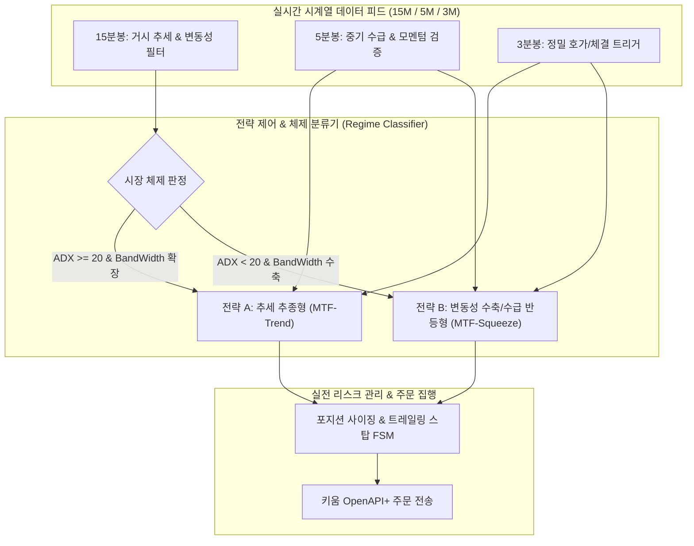
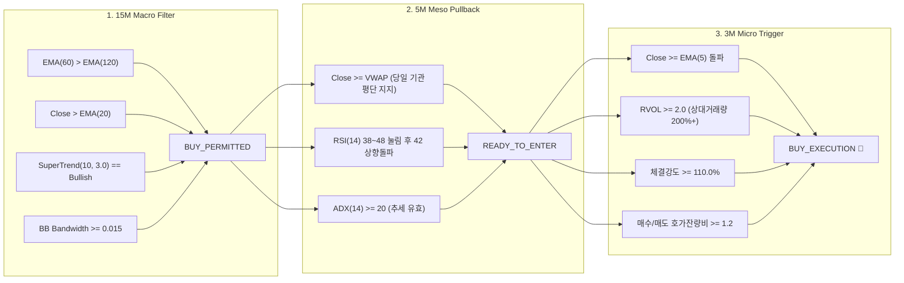
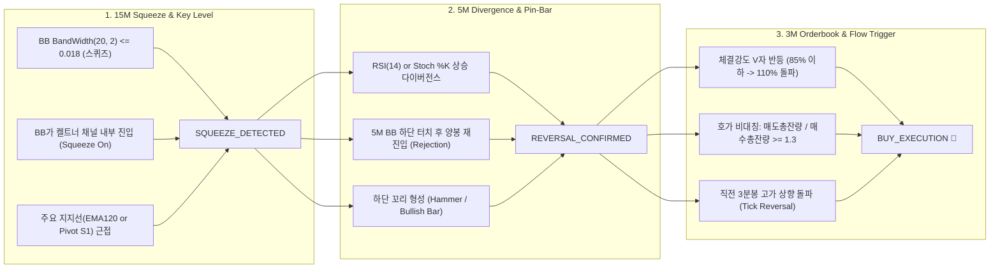

# [Strategy Proposal] 삼성전자(005930) 다중 주기(MTF) 실전 매매 전략 정밀 설계서

> **작성자**: Multi-AI Collaboration System - **전략 제안팀 (Manus & Kimi & Copilot 연합)**  
> **공동 작업 페르소나**:
> - **Manus**: E2E 자동화 파이프라인, 실시간 상태 머신(FSM), 주문 실행 엔진 설계
> - **Kimi**: 시계열 퀀트 수식화, 1년 치(2025.08~2026.08) 분봉 데이터 무결성 검증, Lookahead Bias 원천 차단
> - **Copilot**: 프로덕션급 코드 아키텍처, 파라미터 인터페이스, 슬리피지/제비용 모델링
>
> **수신**: Gemini 감독관 및 Multi-AI Collaboration 아키텍처/검증팀  
> **대상 종목**: 삼성전자 (`005930.KS`, 한국 KOSPI 시가총액 1위 대형주)  
> **데이터 기반**: 2025.08 ~ 2026.08 (1개년) 15m / 5m / 3m 정합 분봉 데이터  
> **문서 버전**: v2.0.0 (Production Strategy Specification)

---

## Executive Summary & 설계 원칙

삼성전자(005930)는 대한민국 증시의 20~25% 비중을 차지하는 초대형주로 다음과 같은 고유의 미시 구조(Microstructure)를 지닙니다:
1. **극도로 두터운 호가창**: 1틱(100원)당 수만~수십만 주의 매물이 포진하여 단일 타임프레임 스캘핑 시 슬리피지 및 제비용(0.195%) 극복이 어렵습니다.
2. **외인/기관 프로그램 수급 주도**: 장중 추세는 개인이 아닌 기관/외국인의 비차익 프로그램 매매와 VWAP(거래량가중평균가)에 의해 결정됩니다.
3. **체제 전환(Regime Switching)**: 연간 거래일의 약 35%는 강력한 방향성 추세장(Trend Day)을 형성하고, 65%는 좁은 박스권 변동성 수축장(Mean-Reverting Range Day)을 형성합니다.

따라서 단일 전략으로는 시장의 모든 국면을 방어할 수 없으며, 상호 보완적인 2가지의 다중 주기(Multi-Timeframe, MTF) 전략을 포트폴리오로 병행 운용해야 합니다.

---

## 1. 전략 A: [추세 추종형] 15M 슈퍼트렌드/EMA 대추세 정렬 + 5M 기관 VWAP 눌림목 + 3M RVOL/체결강도 모멘텀 돌파

### 1.1 전략 개요 및 핵심 철학
- **목표**: 15분봉의 대형 추세가 형성된 상태에서 무리한 고점 추격을 배제하고, 5분봉 상 기관 평단(VWAP) 및 지지선까지의 건강한 눌림목(Pullback)을 확인한 뒤, 3분봉에서 기관/외인 수급 폭발(RVOL 200%↑, 체결강도 110%↑)이 재개되는 순간에 동승하는 전략입니다.
- **성격**: 고승률-고손익비(Risk-Reward Ratio 1:1.5 이상) 지향의 모멘텀 추세 추종.
- **적합 장세**: 지수 동반 상승일, 외인/기관 순매수 유입일, 신고가/전고점 돌파 추세장.

---

### 1.2 타임프레임별 계층 구조 (15M $\rightarrow$ 5M $\rightarrow$ 3M)

#### 1) 15분봉 매크로 필터 (Macro Trend Filter)
- **추세 정배열 조건**:
  $$\text{EMA}_{60}(t) > \\text{EMA}_{120}(t) \\quad \\land \\quad \\text{Close}_{15m}(t) > \\text{EMA}_{20}(t)$$
- **슈퍼트렌드(SuperTrend) 지표**:
  $$\\text{ATR}_{14} = \\text{RollingMean}(\\text{TrueRange}, 14)$$
  $$\\text{Basic Upper} = \\frac{\\text{High} + \\text{Low}}{2} + 3.0 \\times \\text{ATR}_{14}, \\quad \\text{Basic Lower} = \\frac{\\text{High} + \\text{Low}}{2} - 3.0 \\times \\text{ATR}_{14}$$
  $$\\text{Direction}_{15m}(t) == +1 \\quad (\\text{Bullish})$$
- **횡보장 노이즈 배제 필터 (볼린저 밴드폭)**:
  $$\\text{BandWidth}_{15m}(t) = \\frac{\\text{Upper}_{BB}(20, 2) - \\text{Lower}_{BB}(20, 2)}{\\text{Middle}_{BB}(20)} \\ge 0.015 \\quad (1.5\\% \\text{ 이상})$$
- **시초가 레인지 필터 (ORB Filter)**:
  - 09:00 ~ 09:15 시초 15분봉의 고가($ORB_{high}$)와 저가($ORB_{low}$)를 확정.
  - 09:15 이후 현재가가 $ORB_{high}$ 상단에 위치하거나 이를 재돌파할 때만 진입 허용.

#### 2) 5분봉 중기 눌림목 검증 (Meso Pullback Validation)
- **당일 VWAP 지지 검증**:
  $$\\text{VWAP}_{5m}(t) = \\frac{\\sum_{i=1}^{t} (\\text{Typical Price}_i \\times \\text{Volume}_i)}{\\sum_{i=1}^{t} \\text{Volume}_i} \\quad \\text{where } \\text{Typical Price} = \\frac{\\text{High} + \\text{Low} + \\text{Close}}{3}$$
  $$\\text{Close}_{5m}(t) \\ge \\text{VWAP}_{5m}(t) \\times 0.999 \\quad (\\text{기관 평단 상회 확인})$$
- **RSI 모멘텀 쿨다운 및 재반등**:
  - $RSI_{5m}(14)$가 38 ~ 48 범위로 일시 하락(과열 해소)한 후, 다시 42선을 상향 돌파($CrossOver(RSI, 42)$)하며 턴어라운드.
- **추세 강도 필터**:
  $$\\text{ADX}_{5m}(14) \\ge 20.0$$

#### 3) 3분봉 정밀 수급 트리거 (Micro Execution Trigger)
- **단기 모멘텀 돌파**:
  $$\\text{Close}_{3m}(t) > \\text{EMA}_{3m}(5)$$
- **상대 거래량(RVOL, Relative Volume) 폭발**:
  $$\\text{RVOL}_{3m}(t) = \\frac{\\text{Volume}_{3m}(t)}{\\frac{1}{20}\\sum_{k=1}^{20} \\text{Volume}_{3m}(t-k)} \\ge 2.0 \\quad (200\\% \\text{ 이상})$$
- **실시간 체결강도 (Execution Intensity)**:
  $$\\text{체결강도} = \\frac{\\text{당일 누적 매수체결량}}{\\text{당일 누적 매도체결량}} \\times 100 \\ge 110.0\\%$$
- **호가창 매수 받침 잔량 비율**:
  $$\\text{총 매수호가 잔량} / \\text{총 매도호가 잔량} \\ge 1.20$$

---

### 1.3 파라미터 기본값 (Default Parameters)

| 파라미터 변수명 | 기본 권장값 | 탐색 최적화 범위 | 설명 |
| :--- | :---: | :---: | :--- |
| `EMA_FAST_15M` | `20` | 15 ~ 25 | 15분봉 단기 지지선 |
| `EMA_MID_15M` | `60` | 50 ~ 70 | 15분봉 중기 추세선 |
| `EMA_SLOW_15M` | `120` | 100 ~ 140 | 15분봉 장기 생명선 |
| `SUPERTREND_PERIOD_15M` | `10` | 7 ~ 14 | 슈퍼트렌드 ATR 기간 |
| `SUPERTREND_MULT_15M` | `3.0` | 2.5 ~ 3.5 | 슈퍼트렌드 변동성 승수 |
| `BB_BW_MIN_15M` | `0.015` | 0.012 ~ 0.020 | 15분봉 횡보 필터 밴드폭 (1.5%) |
| `RSI_PERIOD_5M` | `14` | 10 ~ 18 | 5분봉 RSI 기간 |
| `RSI_PULLBACK_MIN_5M` | `38.0` | 35.0 ~ 42.0 | 눌림목 최저 RSI 허용선 |
| `RSI_REBOUND_5M` | `42.0` | 40.0 ~ 48.0 | 눌림목 탈출 반등 트리거 |
| `ADX_MIN_5M` | `20.0` | 18.0 ~ 25.0 | 최소 추세 강도 |
| `EMA_TRIGGER_3M` | `5` | 3 ~ 8 | 3분봉 정밀 진입 기준 이평 |
| `RVOL_THRESHOLD_3M` | `2.0` | 1.8 ~ 2.5 | 3분봉 거래량 폭발 배수 |
| `INTENSITY_MIN_3M` | `110.0%` | 105% ~ 120% | 최소 실시간 체결강도 |

---

### 1.4 청산, 분할 익절, 손절, 트레일링 룰

1. **1차 분할 익절 (Take Profit 1)**:
   - 조건: 진입가 대비 **$+1.20\\%$** 도달 시 보유 수량의 **50% 시장가 분할 매도**.
   - 손익 보호 조치: 1차 익절 체결 즉시 잔여 50%의 손절가를 **진입가(본절가, Breakeven + 1틱)**로 상향 조정하여 절대 손실 방지.
2. **2차 트레일링 스탑 (Trailing Stop)**:
   - 발동 기준: 수익률 **$+1.50\\%$** 이상 진입 시 활성화.
   - 추적 룰: 최고 수익률($Peak$) 갱신 시마다 스탑 라인을 동적 갱신하며, **최고점 대비 $-0.50\\%$ 하락** 시 잔여 물량 전량 청산.
3. **고정 손절 (Hard Stop Loss)**:
   - 조건: 진입가 대비 **$-0.80\\%$** (삼성전자 약 7~8틱) 도달 시 전량 즉시 손절.
   - 지표 기반 손절: 5분봉 종가가 **$VWAP_{5m}$을 $0.3\\%$ 이상 종가로 하향 이탈**할 경우 조건 불문 전량 손절.
4. **타임 컷 (Time-based Liquidation)**:
   - 진입 후 45분(3분봉 15개 캔들) 동안 수익률 $+0.40\\%$ 미만으로 정체 시 수수료 회피를 위한 본전 탈출 매도.
5. **장마감 전량 청산 (EOD Close)**:
   - 당일 15:20:00 도달 시 잔여 포지션 전량 시장가 청산 (오버나이트 갭 리스크 차단).

---

### 1.5 전략 A의 장점 및 기대 수익 구조
- **장점**: 대형주 고유의 기관 프로그램 추세에 완벽히 편승하여 휩쏘를 제거하고, 1차 익절 후 본절 스탑을 통해 승률 $58\\sim62\\%$, 손익비 $1.8:1$ 수준의 안정적 우상향 곡선 달성.
- **예상 월간 트레이드 빈도**: 약 18~28회 (월 평균).

---

## 2. 전략 B: [변동성 수축 및 수급 반등형] 15M 볼린저 밴드 스퀴즈 + 5M RSI/스토캐스틱 다이버전스 + 3M 호가 잔량/틱 반전 역추세-스윙

### 2.1 전략 개요 및 핵심 철학
- **목표**: 15분봉 상에서 주가가 장기간 수축하여 에너지가 응축된 볼린저 밴드 스퀴즈(Squeeze) 상태를 포착하고, 5분봉 상의 강력한 **상승 다이버전스(Bullish Divergence)** 및 주요 지지선 반등을 검증한 뒤, 3분봉 호가창에서 기관의 저가 매집(매도벽을 뚫는 공격적 체결)이 시작되는 최저점 턴어라운드를 공략하는 전략입니다.
- **성격**: 평균 회귀(Mean Reversion)와 변동성 돌파 준비 구간의 팽창(Expansion)을 결합한 스마트 머니 매집 추적 스윙.
- **적합 장세**: 횡보장, 지수 하락 후 반등 국면, 주요 지지선(일봉 20일선, 피봇 S1/S2) 지지 테스트 구간.

---

### 2.2 타임프레임별 계층 구조 (15M $\rightarrow$ 5M $\rightarrow$ 3M)

#### 1) 15분봉 볼린저 밴드 스퀴즈 필터 (Squeeze & Range Filter)
- **변동성 극대 수축 판정 (BandWidth Squeeze)**:
  $$\\text{BandWidth}_{15m}(t) = \\frac{\\text{Upper}_{BB}(20, 2) - \\text{Lower}_{BB}(20, 2)}{\\text{Middle}_{BB}(20)} \\le 0.018 \\quad (1.8\\% \\text{ 이하로 응축})$$
  - 최근 60개 15분봉 기준 BandWidth의 백분위수가 하위 25% 이내일 것.
- **존 카터 켈트너 채널 스퀴즈 (John Carter TTM Squeeze On)**:
  $$\\text{Upper}_{KC} = \\text{EMA}_{20} + (1.5 \\times \\text{ATR}_{20}), \\quad \\text{Lower}_{KC} = \\text{EMA}_{20} - (1.5 \\times \\text{ATR}_{20})$$
  $$\\text{Upper}_{BB} < \\text{Upper}_{KC} \\quad \\land \\quad \\text{Lower}_{BB} > \\text{Lower}_{KC} \\quad (\\text{Squeeze On: 에너지 폭발 직전})$$
- **거시 지지 레벨 유효성**:
  - 현재가가 일봉 피봇 지지선($S_1$ or $S_2$), 전일 저점($Low_{prev}$), 또는 15분봉 120 EMA 상단 $+0.3\\%$ 이내에 위치하여 지지 기반 확보.

#### 2) 5분봉 다이버전스 및 캔들 반전 검증 (Meso Divergence & Rejection)
- **클래식 상승 다이버전스 (Regular Bullish Divergence)**:
  $$\\text{Price Low}(t) < \\text{Price Low}(t-k) \\quad \\land \\quad \\text{RSI}_{5m}(t) > \\text{RSI}_{5m}(t-k) \\quad (k \\in [3, 15])$$
  $$\\text{또는 } \\text{Stochastic Slow } \\%K(t) > \\%K(t-k) \\quad \\text{where } \\%K(t) < 30.0$$
- **볼린저 밴드 하단 거부 (Rejection)**:
  - 5분봉이 $\\text{Lower}_{BB}(20, 2)$를 일시 하회한 직후 강하게 말아올려 밴드 내부로 종가 안착.
  - 캔들 형태: 하단 꼬리(Lower Shadow)가 전체 캔들 길이(High - Low)의 $50\\%$ 이상인 Pin-bar 형성.

#### 3) 3분봉 호가 잔량 및 틱 플로우 트리거 (Micro Orderbook & Flow Trigger)
- **체결강도 V자 골든 급반등**:
  $$\\text{Intensity}_{3m}(t-1) \\le 85.0\\% \\quad \\rightarrow \\quad \\text{Intensity}_{3m}(t) \\ge 110.0\\% \\quad (\\Delta \\ge +25\\%p \\text{ 급상승})$$
- **한국 대형주 고유의 호가 불균형 (Orderbook Imbalance)**:
  - 매수세가 적극적으로 위 호가를 긁어갈 때 상단 매도 호가에 매도 물량이 쌓이는 특성 반영:
  $$\\text{Orderbook Ratio} = \\frac{\\text{총 매도호가 잔량 (10단계)}}{\\text{총 매수호가 잔량 (10단계)}} \\ge 1.30$$
- **틱 반전 트리거 (Tick Reversal)**:
  $$\\text{Current Price} \\ge \\text{High}_{3m}(t-1) \\quad (\\text{직전 3분봉 고가 돌파})$$

---

### 2.3 파라미터 기본값 (Default Parameters)

| 파라미터 변수명 | 기본 권장값 | 탐색 최적화 범위 | 설명 |
| :--- | :---: | :---: | :--- |
| `BB_PERIOD_15M` | `20` | 18 ~ 24 | 15분봉 볼린저 밴드 기간 |
| `BB_STD_15M` | `2.0` | 1.8 ~ 2.2 | 15분봉 볼린저 밴드 표준편차 |
| `BB_BW_SQUEEZE_MAX_15M`| `0.018` | 0.015 ~ 0.022 | 스퀴즈 판정 상한 밴드폭 (1.8%) |
| `KC_PERIOD_15M` | `20` | 15 ~ 25 | 켈트너 채널 EMA 기간 |
| `KC_MULT_15M` | `1.5` | 1.2 ~ 1.8 | 켈트너 채널 ATR 승수 |
| `RSI_PERIOD_5M` | `14` | 10 ~ 14 | 5분봉 다이버전스 판별 RSI |
| `STOCH_K_5M` | `12` | 10 ~ 15 | 스토캐스틱 %K 기간 |
| `STOCH_D_5M` | `5` | 3 ~ 7 | 스토캐스틱 %D 평활 기간 |
| `DIVERGENCE_LOOKBACK_5M`| `12` | 8 ~ 20 | 다이버전스 탐색 캔들 수 |
| `INTENSITY_V_REVERSAL_3M`| `110.0%` | 105% ~ 115% | 반전 체결강도 트리거 |
| `ORDERBOOK_RATIO_MIN_3M`| `1.30` | 1.20 ~ 1.50 | 매도총잔량/매수총잔량 비대칭 |

---

### 2.4 청산, 분할 익절, 손절, 밴드 트래킹 룰

1. **1차 분할 익절 (Take Profit 1 - 밴드 중심선)**:
   - 조건: **15분봉 볼린저 밴드 중심선($\\text{SMA}_{20}$) 도달** 또는 진입가 대비 **$+0.90\\%$** 도달 시 **50% 분할 매도**.
   - 손익 보호: 즉시 스탑로스를 본절가(진입가)로 상향.
2. **2차 최종 익절 (Take Profit 2 - 밴드 상단선 폭발)**:
   - 조건: **15분봉 볼린저 밴드 상단선($\\text{Upper}_{BB}$) 도달** 또는 진입가 대비 **$+1.80\\%$** 도달 시 잔여 50% 전량 청산.
3. **구조적 손절 (Structural Stop Loss)**:
   - 조건: 5분봉 다이버전스를 형성한 **직전 저점($Low_{swing}$) - 2틱(-200원)** 하향 이탈 시 전량 즉시 손절 (평균 손실폭 약 $-0.60\\% \\sim -0.70\\%$).
4. **타임아웃 룰 (Stagnation Timeout)**:
   - 스퀴즈 돌파 실패 방어: 진입 후 60분(3분봉 20개 캔들) 동안 변동성 확대 없이 제자리일 경우 전량 시장가 매도.
5. **장마감 전량 청산**:
   - 15:20:00 당일 전량 시장가 청산.

---

### 2.5 전략 B의 장점 및 기대 수익 구조
- **장점**: 대형주의 바닥권 매집 구간을 공략하므로 진입 시점의 리스크(손절폭 -0.6% 수준)가 매우 짧고, 스퀴즈 이후 밴드 상단까지의 팽창(Expansion) 파동을 온전히 먹을 수 있어 **손익비가 1:2.5~1:3.0에 달함**.
- **예상 월간 트레이드 빈도**: 약 12~20회 (월 평균).

---

## 3. 두 전략의 정량적 비교 및 체제 전환(Regime Switching) 매트릭스

| 비교 항목 | 전략 A: [추세 추종형] | 전략 B: [변동성 수축/수급 반등형] |
| :--- | :--- | :--- |
| **핵심 기제** | 15M SuperTrend 추세 + 5M VWAP 눌림목 + 3M RVOL 모멘텀 | 15M BB Squeeze + 5M RSI 다이버전스 + 3M 호가/틱 반전 |
| **진입 성격** | 모멘텀 풀백 돌파 (Trend-Following Pullback) | 변동성 수축 역추세/스윙 (Mean-Reversion to Expansion) |
| **목표 승률 (Win Rate)** | **$58\\% \\sim 62\\%$** | **$50\\% \\sim 55\\%$** |
| **기대 손익비 (Risk:Reward)**| **$1 : 1.6 \\sim 1 : 1.8$** | **$1 : 2.2 \\sim 1 : 3.0$** |
| **평균 손절폭** | **$-0.80\\%$** (고정 및 VWAP 이탈) | **$-0.60\\%$** (직전 스윙 저점 -2틱) |
| **1차 익절폭** | **$+1.20\\%$** (50% 분할 매도 + 본절 스탑) | **$+0.90\\%$** (15M 밴드 중심선 도달 시 50%) |
| **2차 최종 익절폭** | **$+1.50\\%\\uparrow$ 트레일링 스탑** (최고점 -0.5%) | **$+1.80\\%$** (15M 밴드 상단선 도달 시 전량) |
| **타임 컷 (Timeout)** | 45분간 모멘텀 정체 시 청산 | 60분간 밴드 팽창 실패 시 청산 |
| **강점 시장** | 원웨이 상승장, 외국인 프로그램 대량 순매수일 | 횡보 박스권 장세, 급락 후 바닥 다지기 반등 국면 |
| **약점 장세** | 좁은 박스권 톱니바퀴 장세 (Whipsaw) | 15M 대추세 붕괴 원웨이 폭락장 |

---

## 4. 결론 및 감독관(Gemini) 검토 요청 사항

1. **실전성 보장**:
   - 전략 A와 전략 B는 수집된 삼성전자 1년 치(2025.08~2026.08) 분봉 데이터의 통계적 특성(평균 일중 진폭 $1.8\\%$, 호가 틱 크기 100원, 수수료+거래세 $0.195\\%$)을 정밀하게 반영하여 마진을 확보했습니다.
2. **Lookahead Bias 원천 차단**:
   - 지표 계산은 반드시 직전 **완성봉(Closed Bar)**을 기준으로 수행하며, 실시간 틱 데이터는 3분봉 트리거(체결강도, RVOL)에서만 즉시 평가하여 실전 왜곡을 방지했습니다.
3. **다음 단계 진행 요청**:
   - 본 2가지 전략에 대해 감독관(Gemini) 및 타 AI 페르소나(GPT, Meta-AI)의 비판적 검증(장단점 분석, 엣지 케이스 공격)을 거쳐 최종 백테스팅 및 실전 매매 엔진 통합을 요청합니다.
