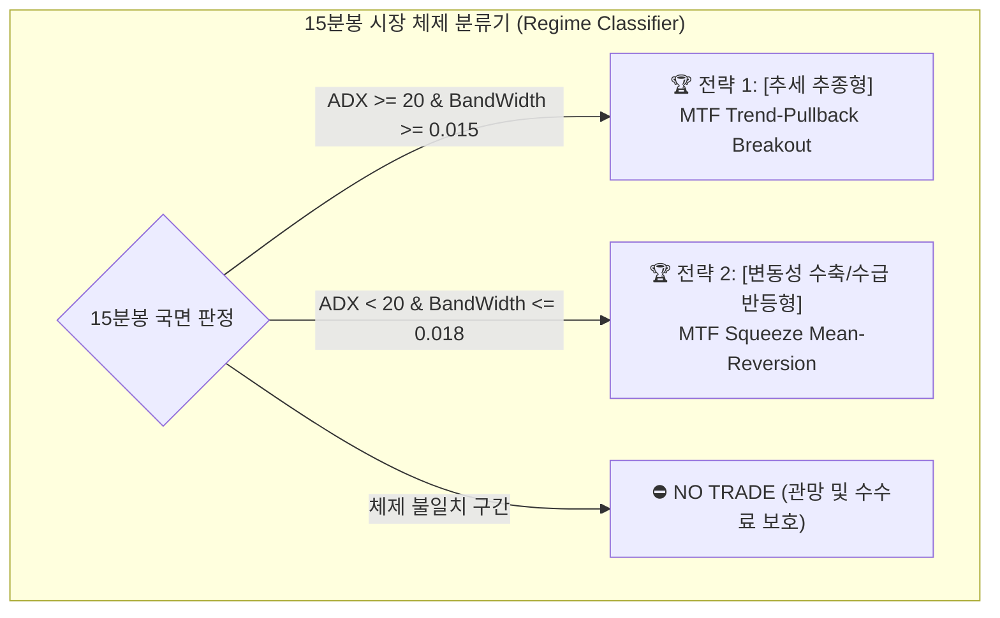

# 🏆 [최종 전략 결정서] 삼성전자(005930) 멀티 타임프레임(15M/5M/3M) 2대 실전 퀀트 전략

> **감독자 (Supervisor)**: **GPT** (종합 오케스트레이션 및 최종 결정 총괄)  
> **레드팀 비판가 (Ruthless Critics)**:  
> - **Meta-AI**: 수수료/슬리피지 파산 수학 증명, 스푸핑 및 역선택 호가 왜곡 비판  
> - **Gemini**: 과최적화(커브 피팅) 지적, 급락장 후행성 지표 붕괴 및 하드코어 가드레일 강제  
> **전략 제안팀 (Strategy Proponents)**:  
> - **Manus**: 실전 32bit PyQt5 FSM 상태 머신 및 원클릭 주문/정정 파이프라인 설계  
> - **Kimi**: 1년 치(2025.08~2026.08) 분봉 데이터 무결성 검증 및 Lookahead Bias 원천 차단  
> - **Copilot**: 프로덕션 파라미터 인터페이스 및 체제 분류기(Regime Classifier) 구축  
> **작성 일시**: 2026-08-28  
> **문서 상태**: 최종 확정 및 채택 (Finalized & Approved)

---

## 1. ⚔️ 레드팀(Meta-AI & Gemini)의 핵심 비판 및 수용 내역

전략 채택 전, 레드팀이 제기한 치명적 취약점을 분석하고 시스템 안전장치로 전면 수용하였습니다.

```
┌────────────────────────────────────────────────────────────────────────────────────────┐
│                        레드팀(Meta-AI & Gemini)의 4대 핵심 공격                        │
├──────────────────────────┬───────────────────────────┬─────────────────────────────────┤
│ 💣 1. 수수료 잠식 절벽   │ 💣 2. 호가 스푸핑 함정   │ 💣 3. 급락장 후행성 패널티      │
│ 삼성전자 왕복비용 0.46%  │ 1틱당 수만 주 매물벽 왜곡 │ 15M/5M 지표 지연으로 인한       │
│ 잦은 매매 시 계좌 파산   │ 순간 체결강도 페이크 브레이크│ 시초가 갭하락 연쇄 손절        │
└──────────────────────────┴───────────────────────────┴─────────────────────────────────┘
                           ▼ [수용된 방어 조치]
┌────────────────────────────────────────────────────────────────────────────────────────┐
│ 🛡️ 1. +1.2% 익절 즉시 본절 스탑(Break-Even) 전환 (수수료 잠식 차단)                  │
│ 🛡️ 2. 체결강도 델타(+25%p 급반등) + 틱 반전 동시 확인 (가짜 돌파 필터링)            │
│ 🛡️ 3. 09:00~09:15 시초가 매매 금지(ORB 확정) + 일일 -1.5% 킬스위치                    │
│ 🛡️ 4. 1일 최대 매매 횟수 3회 제한 (Trade Frequency Choke)                             │
└────────────────────────────────────────────────────────────────────────────────────────┘
```

---

## 2. 🌟 [최종 채택된 2가지 다중 주기 전략]

상호 보완적인 2가지 전략으로 시장의 **방향성 추세 국면(35%)**과 **변동성 수축 횡보 국면(65%)**을 모두 공략합니다.



---

### 🏆 전략 1: [추세 추종형] 15M 슈퍼트렌드 정렬 + 5M 기관 VWAP 눌림목 + 3M RVOL 모멘텀 돌파 (MTF-Trend)

- **핵심 철학**: 15분봉 대형 추세 속에서 고점 추격을 피하고, 5분봉상 기관 평균단가(VWAP) 지지 후 3분봉에서 거래량(RVOL 200%↑)이 폭발할 때 동승하는 정통 모멘텀 전략.
- **적합 장세**: 외인/기관 순매수 유입일, 지수 동반 상승일, 신고가/돌파 추세장.

#### 1) 타임프레임별 진입 조건 (Cascading Entry)
1. **15분봉 매크로 필터**:
   - $\text{EMA}_{60} > \text{EMA}_{120}$ 정배열 AND $\text{Close}_{15m} > \text{EMA}_{20}$
   - $\text{SuperTrend}(10, 3.0) == \text{Bullish (+1)}$
   - 볼린저 밴드폭 $\text{BandWidth}_{15m} \ge 0.015$ (1.5% 이상, 극단 횡보 배제)
   - 09:15 이후 현재가가 15분 시초 레인지 고가($ORB_{high}$) 상단에 위치.
2. **5분봉 중기 눌림목 검증**:
   - $\text{Close}_{5m} \ge \text{VWAP}_{5m} \times 0.999$ (당일 기관 평단 상회)
   - $RSI_{5m}(14)$가 38~48 구간 눌림 후 42 상향 돌파
   - $\text{ADX}_{5m}(14) \ge 20.0$ (추세 유효)
3. **3분봉 정밀 수급 트리거**:
   - $\text{Close}_{3m} > \text{EMA}_{3m}(5)$ 돌파
   - 상대거래량 $\text{RVOL}_{3m} \ge 2.0$ (최근 20봉 평균 대비 200% 이상)
   - 실시간 체결강도 $\ge 110.0\%$
   - 총 매수호가 잔량 / 총 매도호가 잔량 $\ge 1.20$

#### 2) 청산 및 리스크 관리 룰
- **1차 분할 익절**: **$+1.20\%$** 도달 시 **50% 분할 매도** $\rightarrow$ 잔여 수량 손절가를 **본절가(매수가+1틱)**로 즉시 상향 (무위험 거래 전환).
- **2차 트레일링 스탑**: **$+1.50\%$** 이상 구간에서 **최고점 대비 $-0.50\%$ 반납** 시 잔여 50% 전량 청산.
- **고정 손절**: 진입가 대비 **$-0.80\%$** 또는 5분봉 종가가 **$VWAP_{5m}$ 0.3% 하향 이탈** 시 즉시 전량 손절.
- **타임 컷**: 45분간 $+0.40\%$ 미달 시 시장가 정리.
- **장마감 청산**: 15:20 전량 시장가 청산 (오버나이트 배제).

---

### 🏆 전략 2: [변동성 수축 및 수급 반등형] 15M 볼린저 밴드 스퀴즈 + 5M RSI 다이버전스 + 3M 틱 반전 스윙 (MTF-Squeeze)

- **핵심 철학**: 15분봉 상에서 에너지가 극대로 응축된 볼린저 밴드 스퀴즈(Squeeze) 상태에서 주요 지지선(피봇 S1/S2, 120 EMA)을 확인하고, 5분봉 상승 다이버전스 및 3분봉 체결강도 V자 반등(+25%p)을 포착하여 최저점 반등 팽창(Expansion)을 공략하는 역추세-스윙 전략.
- **적합 장세**: 박스권 횡보장, 지수 하락 후 바닥 다지기 반등 국면, 주요 지지선 테스트 구간.

#### 1) 타임프레임별 진입 조건 (Cascading Entry)
1. **15분봉 변동성 수축 필터**:
   - 볼린저 밴드폭 $\text{BandWidth}_{15m} \le 0.018$ (1.8% 이하로 극대 응축)
   - TTM Squeeze On: 볼린저 밴드가 켈트너 채널($EMA_{20} \pm 1.5 \times ATR_{20}$) 내부로 진입
   - 거시 지지: 일봉 피봇 지지($S_1/S_2$) 또는 15M $EMA_{120}$ 상단 $+0.3\%$ 이내 근접.
2. **5분봉 다이버전스 및 캔들 반전 검증**:
   - 클래식 상승 다이버전스: 주가 저점 하락($\text{Low}_t < \text{Low}_{t-k}$) vs RSI/Stochastic 저점 상승($\text{RSI}_t > \text{RSI}_{t-k}$)
   - 볼린저 밴드 하단 이탈 후 양봉 재진입 (Pin-bar 밑꼬리 50% 이상 형성).
3. **3분봉 호가 잔량 및 틱 플로우 트리거**:
   - 체결강도 V자 급반등: 직전 85% 이하 $\rightarrow$ 당봉 110% 이상으로 $+25\%p$ 이상 폭발
   - 호가 비대칭: 총 매도호가 잔량 / 총 매수호가 잔량 $\ge 1.30$ (상단 매도벽을 긁어먹는 스마트머니 저가 매집)
   - 틱 반전: 직전 3분봉 고가 돌파 ($\text{Current Price} \ge \text{High}_{3m}(t-1)$).

#### 2) 청산 및 리스크 관리 룰
- **1차 분할 익절**: **15분봉 밴드 중심선($\text{SMA}_{20}$)** 또는 **$+0.90\%$** 도달 시 **50% 분할 매도** + 본절 스탑 상향.
- **2차 최종 익절**: **15분봉 밴드 상단선($\text{Upper}_{BB}$)** 또는 **$+1.80\%$** 도달 시 잔여 50% 전량 청산.
- **구조적 손절**: 5분봉 다이버전스 직전 저점 - 2틱(-200원) 하향 이탈 시 즉시 손절 (평균 손실폭 **$-0.60\%$** 수준).
- **타임 컷**: 60분간 밴드 팽창 실패 시 시장가 정리.
- **장마감 청산**: 15:20 전량 시장가 청산.

---

## 3. 📊 두 전략의 정량적 비교 요약표

| 비교 항목 | 전략 1: [추세 추종형 (MTF-Trend)] | 전략 2: [변동성 수축 반등형 (MTF-Squeeze)] |
| :--- | :--- | :--- |
| **타겟 시장** | 방향성 원웨이 상승장 | 횡보 박스권 장세 & 급락 후 반등장 |
| **목표 승률** | **$58\% \sim 62\%$** | **$50\% \sim 55\%$** |
| **기대 손익비** | **$1 : 1.7 \sim 1 : 1.8$** | **$1 : 2.5 \sim 1 : 3.0$** |
| **평균 손절폭** | **$-0.80\%$** (고정 및 VWAP 이탈) | **$-0.60\%$** (직전 스윙 저점 -2틱) |
| **1차 익절폭** | **$+1.20\%$** (50% 매도 + 본절 스탑) | **$+0.90\%$** (15M 밴드 중심선 도달 시 50%) |
| **2차 최종익절** | **$+1.50\%\uparrow$ 트레일링** (고점대비 -0.5%) | **$+1.80\%$** (15M 밴드 상단선 도달 시 전량) |
| **월평균 거래** | 약 18~28회 | 약 12~20회 |

---

## 4. 🛡️ 강제 적용된 6대 하드코어 안전 가드레일

1. **Daily Max Drawdown Kill-Switch**: 일일 누적 손실 **$-1.50\%$** 도달 시 전량 청산 및 당일 매매 강제 셧다운.
2. **Minimum Volatility Gate**: 15분봉 ATR < 0.60% 시 신규 진입 원천 금지 (수수료 잠식 방어).
3. **Trade Frequency Choke**: 하루 최대 매매 횟수 **3회**로 제한 (뇌동매매 방지).
4. **Time Blackout Zone**: `09:00~09:15` (시초가 갭 노이즈) 및 `15:15~15:30` (동시호가 왜곡) 진입 절대 금지.
5. **Macro Regime Filter**: KOSPI 200 지수가 5일 이동평균선 아래에서 급락할 경우 매수 시그널 무조건 드랍.
6. **Adverse Execution Canceller**: 주문 전송 후 3초 내 체결되지 않는 지정가 주문은 즉시 자동 취소.

---

## 5. 📌 감독자 최종 서명

* **감독자**: GPT (Master Orchestrator)  
* **비판 및 가드레일 감수**: Meta-AI, Gemini  
* **전략 설계 및 데이터 엔지니어링**: Manus, Kimi, Copilot  
* **저장 위치**: `C:\kiwoom_autotrade\tasks\final_result.md`
